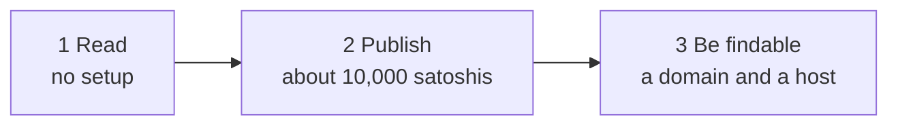

# Quickstart

Three steps, each a few commands: read an address, publish your own, make
your domain answer for it. You need [Docker](https://docs.docker.com/get-docker/)
(or a [release binary](https://github.com/lightwebinc/bfinger/releases)) and,
for step 2, a small amount of BSV.



## 1. Read an address

```console
$ alias bfinger='docker run --rm -it -v bfinger:/home/nonroot/.bfinger \
    -e BFINGER_HEADER_URL=woc:main ghcr.io/lightwebinc/bfinger'
$ bfinger 1bsv@lightweb.net -ansi
```

The first time, bfinger shows the address's identity key and fingerprint and
asks whether to trust it. Answer `y`: the key is pinned in the `bfinger`
volume, and every later answer must be signed by it (or by a key it
rotated to). The first line of the answer is what matters:

| First line | Meaning |
| --- | --- |
| `VERIFIED` | Signature, sequence, key and Bitcoin proof all checked |
| `VERIFIED-UNMINED` | All checked, but the latest update is not in a block yet |
| anything else (`REFUSED-...`, `NO-TOKEN`, ...) | Something did not check out, or there is no record; nothing from the host is printed as true |

`-header-url woc:main` (set above through `BFINGER_HEADER_URL`) is where the
block headers come from. bfinger checks the proof of work of every header,
so the source cannot lie without mining a block. Other choices:
[header sources](docs/configuration.md#header-sources).

## 2. Publish your own

**Create an identity.**

```console
$ bfinger init
created /home/nonroot/.bfinger
identity key 02abab…abab
fingerprint  SHA256:…
fund address 1Abc…xyz
```

The identity lives in the `bfinger` volume. Back it up: it is your key.

**Fund it.** Send a little BSV to the fund address. About 10,000 satoshis
(0.0001 BSV, a fraction of a cent) covers your first record and several
updates. Any wallet or exchange that can send BSV to an address works. If
you have no wallet yet, search for a **BRC-100 wallet**, the BSV standard
for wallets that apps can talk to:

- **BSV Desktop** for Windows, macOS and Linux: [desktop.bsvb.tech](https://desktop.bsvb.tech/)
- **BSV Browser** for phones: [browser.bsvb.tech](https://browser.bsvb.tech/)
- The standard itself: [BRC-100](https://github.com/bsv-blockchain/BRCs/blob/master/wallet/0100.md)

When the payment has one confirmation (about ten minutes), import it by its
transaction id, which your wallet shows:

```console
$ bfinger fund -txid 1111…1111
imported 1 output(s), 10000 sat, mined at height 912430; wallet 1 output(s), 10000 sat
```

bfinger checks the payment's proof against the headers before it counts it.

**Point it at a host and publish.** Records are kept by overlay hosts.
Use any host that carries the `tm_finger` topic, or your own (with none yet,
do step 3 first and come back), and settle through a public ARC service:

```console
$ alias bfinger='docker run --rm -it -v bfinger:/home/nonroot/.bfinger \
    -e BFINGER_HEADER_URL=woc:main \
    -e BFINGER_FACADE=https://finger.example.com \
    -e BFINGER_SETTLE=arcade:https://arc.gorillapool.io/v1 \
    -e BFINGER_PROOFS=async \
    ghcr.io/lightwebinc/bfinger'
$ bfinger create alice@example.com -set status="hello, world" -yes
$ bfinger status "back soon" -yes
```

Nothing is sent without `-yes`; leave it off to see what would be built.
`proofs = async` returns as soon as the network accepts the update; the
proof is collected by your next update (or `bfinger publish -resume`).

Anyone can now read you by key:
`bfinger -host https://finger.example.com 02abab…abab`.

## 3. Make your domain answer

For `alice@example.com` to work by name, `example.com` publishes two small
documents and a host serves your record. On a server with Docker and a DNS
name:

```console
$ curl -fsSLO https://github.com/lightwebinc/bfinger/releases/latest/download/compose.yaml
$ docker run --rm --user "$(id -u):$(id -g)" -v "$PWD:/w" -w /w ghcr.io/lightwebinc/bfinger \
    domain-docs alice@example.com -host https://finger.example.com -key 02abab…abab -out site
$ HOST=finger.example.com docker compose up -d
```

`-key` is the identity key `init` printed. The stack serves the resolve
answer from `site/`; copy `site/manifest.json` to
`https://example.com/manifest.json` (details in
[docs/self-host.md](docs/self-host.md)) and check:

```console
$ bfinger alice@example.com -v
```

## Next

- [docs/user-guide.md](docs/user-guide.md): everything a reader and a publisher can do
- [docs/self-host.md](docs/self-host.md): running hosts, catching up from peers
- [docs/examples.md](docs/examples.md): a working example for every command
- Stuck? `bfinger doctor` reports your identity, wallet, header source, facade and settlement leg.
