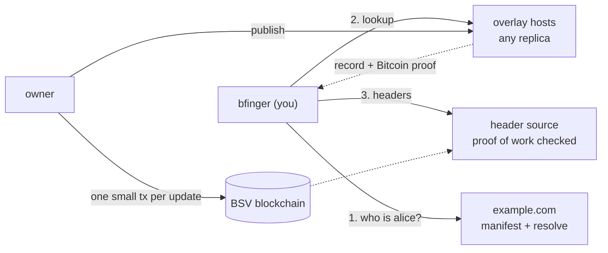

# bfinger

[](https://github.com/lightwebinc/bfinger/actions/workflows/ci.yml)
[](https://github.com/lightwebinc/bfinger/actions/workflows/codeql.yml)
[](https://github.com/lightwebinc/bfinger/releases)
[](https://pkg.go.dev/github.com/lightwebinc/bfinger)
[](LICENSE)

A Bitcoin-era descendant of the UNIX `finger` command. Ask what
`user@domain` currently says about itself and get an answer that proves
itself, instead of one you trust because of who handed it over.

```console
$ bfinger -header-url woc:main alice@example.com
alice@example.com
  VERIFIED   signature, sequence 7 (update), proof at height 912430
  key        02abab…abab  (pinned 2026-04-11)
  plan       shipping 2.0
  status     available
```

**New here? Start with [QUICKSTART.md](QUICKSTART.md).**

## How it works



- **The domain names the key.** `example.com` answers which identity key is
  `alice`; your copy of bfinger pins that key on first contact and refuses a
  changed key unless the old one signed the rotation.
- **The domain names its hosts, too.** The same `/manifest.json` lists the
  overlay services that answer for the domain under `metanet.overlays`, as
  [BRC-180](https://github.com/bsv-blockchain/BRCs/blob/master/overlays/0180.md)
  specifies, so bfinger asks the lookup host the domain declares
  (`ls_finger`) and never guesses a hostname. `bfinger domain-docs` writes
  that entry, and `tm_finger` for submissions, for you. A declared host is
  still only a claim: everything it serves is checked.
- **Hosts are replicas, not authorities.** Any host can serve the record.
  One that edits it produces something that fails the check, so bfinger
  refuses it. Ask several with `-quorum 2`.
- **The chain holds the state, not the data.** Each update mines a few
  hundred bytes that commit to the record and spend the previous update, so
  the history cannot fork. The record itself travels beside it in a
  transaction that is never mined, which is why the owner can retract it.
- **You check everything.** Signature, proof, sequence and key, against
  block headers whose proof of work bfinger checks itself. `VERIFIED` means
  all of it passed. Exit status is `0` verified, `1` refused, `2` usage or
  transport failure; never `0` on an unverified answer.

The argument in full: [docs/overview.md](docs/overview.md). bfinger is the
worked example in the pattern paper
[_The bstack: publish once, prove everything, and let users ride free_](https://1bsv.net/papers/bstack-patterns.pdf).

## Install

| | |
| --- | --- |
| Container | `docker run --rm -it ghcr.io/lightwebinc/bfinger -header-url woc:main alice@example.com` (linux/amd64, linux/arm64) |
| Binary | [Releases](https://github.com/lightwebinc/bfinger/releases): static builds for Linux and macOS, amd64 and arm64, with `SHA256SUMS` |
| Source | `go build ./cmd/bfinger` (Go 1.26.2 or later) |
| A host of your own | `HOST=finger.example.com docker compose up -d` with the release's `compose.yaml` ([docs/self-host.md](docs/self-host.md)), or one CloudFormation stack on AWS ([deploy/aws](deploy/aws/README.md)) |

## Documentation

| If you want to | Read |
| --- | --- |
| Try it in five minutes | [QUICKSTART.md](QUICKSTART.md) |
| Read, verify and pin addresses; publish and update your own record | [docs/user-guide.md](docs/user-guide.md) |
| Look up a setting, flag or environment variable | [docs/configuration.md](docs/configuration.md) |
| Copy a working command | [docs/examples.md](docs/examples.md) |
| Run a host and make your domain answer for handles | [docs/self-host.md](docs/self-host.md) |
| Load the modules into an overlay host you already run | [host/README.md](host/README.md) |
| Understand why it is built this way | [docs/overview.md](docs/overview.md) |
| See the components and how data and payments flow | [docs/architecture.md](docs/architecture.md) |
| See every operation as a diagram | [docs/flows.md](docs/flows.md) |
| Know who learns what from a lookup or a publication | [docs/privacy.md](docs/privacy.md) |
| Implement a compatible reader or host | [docs/committed-record.md](docs/committed-record.md) (the specification), [docs/known-keys.md](docs/known-keys.md), [docs/host-selection.md](docs/host-selection.md) |
| Find your way around the code | [docs/internals.md](docs/internals.md), [docs/owner-flow.md](docs/owner-flow.md) |

## Status

Built and working end to end: the reader (lookups, `verify`, `-watch`,
`-json`, key pinning), the publisher (`init`, `fund`, `create`, `status`,
`rotate`, `retire`, `kill`, `pay`, `receive`, `publish -resume`, `doctor`,
`domain-docs`, `serve-wallet`), sub-stores, and the two overlay host modules
with a container image and a one-file host stack.

Designed, not built yet: handle-certificate verification (BRC-52), a
messagebox for payment notices, delegation and the named stores it writes,
host-side charging for lookups, content only a payer can read (BRC-369), and
a reader-side spend check. [docs/architecture.md](docs/architecture.md#seams)
lists them all, and [docs/overview.md](docs/overview.md#the-seams-left-open)
explains the hook that makes each possible.

## Build

```bash
make verify         # what CI runs: format, vet, dependency set, licences, build, tests under -race
make host-docker    # the host modules and their tests, in Node 24
make docker-build   # the command's image
make dist           # the release tarballs
```

Two direct Go dependencies, both pinned exactly and asserted by `make
verify`: [go-sdk](https://github.com/bsv-blockchain/go-sdk) and
[bcommon](https://github.com/lightwebinc/bcommon), the public library that
holds bfinger's generic half.

## Licence

Apache-2.0. One dependency is under the Open BSV License Version 5, whose
grant is revocable and which limits use to the BSV blockchains; `NOTICE`
explains, and `LICENSE-THIRD-PARTY` carries every licence text.
