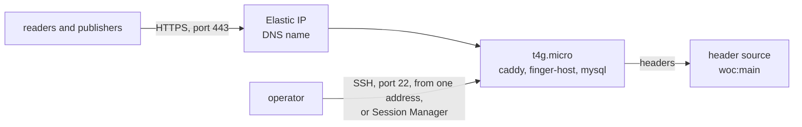

# A finger host on AWS

One CloudFormation stack: a small VPC, one arm64 instance with Docker, an
Elastic IP, an optional Route 53 record, and SSH from one address (Session
Manager always works). About USD 10 a month in us-east-2 as of 2026
(t4g.micro, 16 GiB gp3, one public IPv4). Delete the stack and it is gone.



## Deploy

```console
$ curl -fsSLO https://github.com/lightwebinc/bfinger/releases/latest/download/finger-host.yaml
$ aws cloudformation deploy --stack-name finger --capabilities CAPABILITY_IAM \
    --template-file finger-host.yaml --parameter-overrides \
    HostName=finger.example.com HostedZoneId=Z0123456789ABC \
    "SSHPublicKey=$(cat ~/.ssh/id_ed25519.pub)" SSHFrom=203.0.113.7/32 \
    ComposeUrl=https://github.com/lightwebinc/bfinger/releases/latest/download/compose.yaml
$ aws cloudformation describe-stacks --stack-name finger --query 'Stacks[0].Outputs'
```

With `ComposeUrl` set, the instance starts the stack of
[docs/self-host.md](../../docs/self-host.md) on first boot, in `/opt/finger`,
with a generated `.env` (the host name, the header source, and a random admin
token and database password). Caddy fetches the certificate once DNS points
at the Elastic IP, which the Route 53 record does within minutes.

| Parameter | Default | |
| --- | --- | --- |
| `HostName` | none | the host's DNS name |
| `HostedZoneId` | empty | Route 53 zone for the A record; empty to manage DNS yourself |
| `SSHPublicKey`, `SSHFrom` | empty | an OpenSSH public key and the one CIDR allowed to port 22; empty opens no port |
| `InstanceType` | `t4g.micro` | 1 GiB plus 2 GiB swap runs the stack; `t4g.small` for a busier topic |
| `ImageParameter` | Amazon Linux 2023 arm64 | the x86_64 path with an x86 instance type |
| `VolumeSize` | `16` | GiB of gp3 |
| `Headers` | `woc:main` | the host's header source |
| `ComposeUrl` | empty | the compose file to start; empty installs Docker only |

## Operate

```console
$ ssh ec2-user@<PublicIp>
$ cd /opt/finger && docker compose ps && docker compose logs --tail 20 host
$ docker compose pull && docker compose up -d        # update to the pinned images
```

To catch up from another host, add `SYNC_PEERS=tm_finger=https://other.example.net`
to `/opt/finger/.env`, `docker compose up -d`, then trigger the sync as
[docs/self-host.md](../../docs/self-host.md) shows. Records live in the
database volume on the instance's disk; a new instance fills itself again
from a peer, or the owner re-sends with `bfinger publish -resume`.

## Remove

```console
$ aws cloudformation delete-stack --stack-name finger
```
