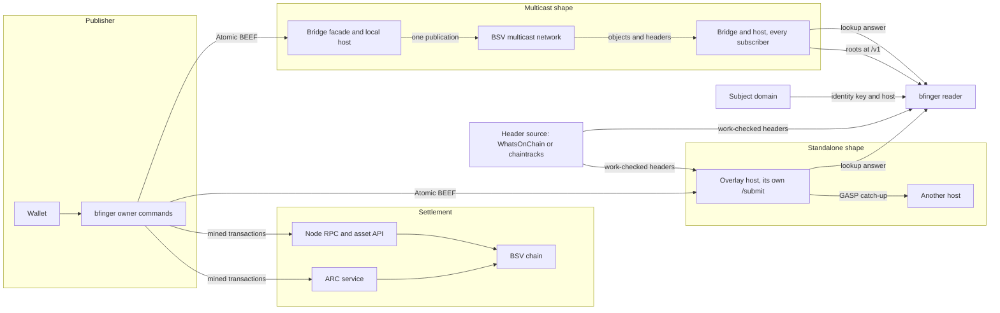
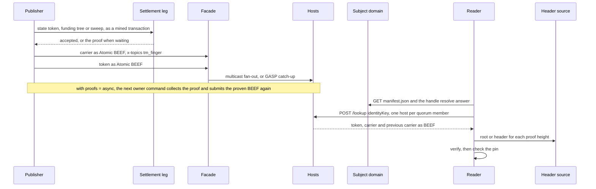

# Architecture

The components, which way the bytes move between them, who pays for each
movement, and the standards in play. Why it is built this way is in
[overview.md](overview.md); the normative rules are in
[committed-record.md](committed-record.md), the publisher's files in
[owner-flow.md](owner-flow.md), host selection in
[host-selection.md](host-selection.md), and what each party learns in
[privacy.md](privacy.md). Anything marked SEAM is designed and not built.

## Components

| Component | Role |
| --- | --- |
| `bfinger` reader | Resolves an address, asks one or more hosts, verifies the answer against a header source, checks the pin |
| `bfinger` owner commands | Build transitions, pay miners through a settlement leg, submit objects to a facade |
| Wallet | Embedded (bfinger's own key and coin) or a BRC-100 wallet over the wire (`wallet = wire`) |
| Settlement leg | Where mined transactions go: an ARC service (`arcade:`), a node's RPC (`rpc:`) or a bare EF ingress (`tcp:`) |
| Header source | Where proofs are checked: WhatsOnChain, a chaintracks service, or an overlay bridge ([below](#header-sources)) |
| Overlay host | The reference overlay host with `tm_finger` (admission) and `ls_finger` (lookup); image `ghcr.io/lightwebinc/finger-host` |
| Facade | Where objects are submitted: `POST /submit` on a host, or on an overlay bridge in front of one |
| Overlay bridge | Multicast shape only: the facade, the object feed into its host, and a header API |
| Subject domain | Serves `manifest.json` and the handle resolve answer (`bfinger domain-docs` writes both) |

The publisher and the reader never talk to each other. Everything between
them travels as objects that carry their own proof, so a host can be added,
swapped or lost without anyone reconfiguring.

## Deployment shapes

| | Standalone | Multicast network |
| --- | --- | --- |
| Facade | the host's own `/submit` | an overlay bridge's `/submit`, which admits to its local host and publishes the object once to the network |
| How other hosts get objects | they catch up from a peer with GASP | the network delivers each object to every subscribed host's bridge, which submits it to its host |
| Host header source | WhatsOnChain or chaintracks | the bridge's own header API |
| Reader header source | WhatsOnChain or chaintracks | any of the three, including a bridge's `/v1` |

**Standalone.** One host with no network behind it is a complete deployment
([self-host.md](self-host.md): the `finger-host` image, MySQL and Caddy in one
compose stack). A second host catches up with GASP: it receives unspent outputs
only (every carrier, but only each identity's current token) and rebuilds each
chain from them, as it does on restart. Kills reach it too: a sweep's
tombstone is an unspent topic output, so sync carries the sweep, and the host
reads the spends from the sweep's own inputs
([flows.md 16](flows.md#16-catching-up-from-a-peer)).

**Multicast.** A BSV multicast network delivers BEEF objects to every
subscribed host. Without it, N hosts re-submitting each object to each other
move it on the order of N squared times, fully verifying it at every arrival
before discarding a duplicate. With it, the publisher submits once. Block
headers arrive over the same network; the bridge checks their proof of work
against a configured floor, stores them, and serves them to its host and to
any reader pointed at it.

## Header sources

The reader and the host check every proof against a header source; the
publisher uses one to check imported coin and, with no node, for the chain tip.
There is no default (`header_url` is required for anything that prints
`VERIFIED`).

| `header_url` | What it is | Checked how |
| --- | --- | --- |
| `woc:main`, `woc:test` | the public WhatsOnChain API | every header is hashed and must meet its own target and the network floor |
| `chaintracks:https://host/v2` | a chaintracks v2 service | as WhatsOnChain |
| `https://bridge.example.net` | an overlay bridge's `/v1` routes | roots only, taken as given: the bridge checked the work when it received them |

The `network` key (`main` by default, `test`, `regtest`) sets the proof-of-work
floor (mainnet difficulty 4e9, far below any real mainnet block and far above
what a lie is worth mining) and the address prefix. A `woc:` source must match
it. A 404 for a height (on a bridge, `GET /v1/root/{height}`) means the source
does not hold that height yet; any other failure is an error. Keeping those
apart is load bearing: collapsing them makes an unreachable header service look
exactly like a forged proof. See
[configuration.md](configuration.md#header-sources).

## Flows

**Funding the wallet.** The wallet is bfinger's own and shared with nothing, so
two tools cannot double spend each other. Coin arrives by `fund -txid` (a mined
payment you sent to the fund address from your own wallet), `receive` (a
BRC-29 payment), or `fund` without `-txid`, which mines coinbase: only on a
regtest chain you run (development and tests). The first two check the proof
against the header source
([owner-flow.md](owner-flow.md#coin-into-the-wallet)).

**Settlement.** One mined transaction per transition, one per funding tree (16
carriers by default), and one sweep per tree if the kill switch is used. The
carrier never goes to a settlement leg: it is non-final with an nLockTime in
2100.

| `settle` | Answers | Needs a node |
| --- | --- | --- |
| `arcade:<url>` (any ARC service) | policy synchronously, then the network's verdict | no, when `proofs = async`, `header_url` is set and `funding` is not `wallet` |
| `rpc:<url>` | the node's answer | yes (`rpc`, `asset`) |
| `tcp:<host:port>` | nothing: writes EF bytes once and closes | yes (`rpc`, `asset`) |

The settlement leg and the object leg never share a connection. An ingress
locks a stream's grammar from its first four bytes, so a BEEF written down the
settlement socket would silently poison the stream. Nothing in the publishing
package accepts both a transaction and a BEEF, and a test walks the exported
declarations to keep it that way.

**Proofs.** With `proofs = wait` (the default) a transition polls for its
proof every 5 seconds for up to 10 minutes before publishing. With `proofs =
async` it publishes once the leg reports the network took the transaction,
about two seconds, and every later owner command collects outstanding proofs
first; `publish -resume` collects them and re-sends the current state's
objects without touching the settlement leg. An ARC leg is asked first, because it
reports a refusal as well as a proof; the node's asset API answers for anything
ARC did not broadcast. A proof whose height disagrees with the reported height
is refused, and every proof is bounds-checked before the SDK parses it. Async
is refused with `tcp:` (unless `funding = wallet`), where the proof is the only
evidence of acceptance. `pay` and `kill` always wait for the proof, from the
ARC service when there is no node.
Two rules keep an unmined chain bounded: a fee input's parent must be a real,
proven transaction; and change from a transaction still awaiting its proof is
not spent, except change of the token or tree the transition already carries
in full, which is what lets a home with one coin publish twice inside a block.

**Proof upgrade.** When a proof is collected the publisher submits the proven
BEEF once. The engine would drop it as a duplicate, so the reference host
verifies the path against its own headers and stores it; in the multicast
shape every other host does the same, independently.

**The object leg.** Carrier first, then the token, each as Atomic BEEF, each
one POST with exactly one topic in `x-topics` (either order works; carrier
first lets the token join at once). HTTP 200 with nothing admitted means the
engine already holds the object, so a re-POST after a crash is safe
(`publish -resume`). Funding
trees and sweeps travel this leg too, so hosts can see a later spend of a
tree's outputs.

**Discovery.** The reader fetches `https://example.com/manifest.json`, which
names the resolve endpoint and the overlay host. Both rest on control of the
domain alone: no plain HTTP fallback, no alternative location, and a redirect
to another host is not followed. Addressing by identity key skips this step.

**The read.** One POST per host until the quorum is met, asking only the base
class. The answer is the current token, the current carrier and the previous
carrier when there is one, so the revealed witness can be checked. With
`-quorum 2` or more, hosts that disagree give `REFUSED-FORK`.

**A payment.** The payer derives a BRC-29 destination from the payee's
identity key, mints an ordinary P2PKH payment and settles it on the same leg
as everything else. Nothing about it reaches a topic, a facade or a lookup
route. The notice the payee needs is a local file, delivered out of band
(BRC-33 messagebox: SEAM).

## What each flow costs

| Flow | Who pays | Cost |
| --- | --- | --- |
| Settlement | the publisher | miner fee, 1 satoshi per byte, 250 satoshi floor |
| Proof | the publisher | an ARC query, or a node the publisher runs or rents |
| Object leg | nobody | one POST per object |
| Multicast fan-out | each receiving host, on a metered network | delivered bytes |
| Header delivery to a bridge | the bridge's operator | delivered bytes |
| Discovery | nobody | two GETs per read |
| Lookup, base class | nobody, on any conforming host | one POST per host in the quorum |
| Header read | nobody | one request per merkle path checked |
| BRC-29 payment | the payer | the amount plus one miner fee |

Measured on the published test vector ([testdata/golden](../testdata/golden)):
the create token is 327 bytes and pays 330 satoshis, an update token 440 bytes
and 446, a kill sweep 398 bytes and 405, at bfinger's fee rate of about 1
satoshi a byte (250 at least). The carrier pays nothing. On the
network, one update transition is 1954 bytes: 823 for the carrier's Atomic BEEF
and 1131 for the token's. The publisher pays miners and nobody else; delivery
is metered where it arrives. A verified lookup of the test vector makes two
header requests, one per merkle path, and `-watch` repeats the whole lookup
every 15 seconds by default.

## Host-side charging: a seam

Built: three question classes, and a lookup service that refuses a question
carrying a member it does not define. Not built: any charge. No host here asks
for money and no client here can pay.

| Query | Answer | Price |
| --- | --- | --- |
| `{ identityKey }` | token, carrier, previous carrier | free on every conforming host |
| `{ identityKey, pending: true }` | the same, plus tokens whose carrier has not arrived | free on every conforming host |
| `{ identityKey, carrier }` | one sub-store carrier by its commitment | priceable (BRC-105, BRC-121, BRC-166 402: SEAM) |

A price attaches to a question class, never to part of an answer, and the
unknown-member refusal stops anyone minting a priced alias of a free question.
A price buys neither exclusivity (every host holds a copy) nor a BRC-190 gate,
and terms live at the host's own route, never in the record. A 402 is an
answer: the reader reports it and stops rather than asking a replica, which is
why a 402 on the base class would make the directory unreadable. The rules and
reasoning are [committed-record.md](committed-record.md) section 14.

## Standards

A `bcommon/` path is a package of `github.com/lightwebinc/bcommon`, the library
of generic building blocks bfinger imports; an `internal/` path is bfinger's
own.

| Standard | What it provides | Where | Status |
| --- | --- | --- | --- |
| BRC-9, BRC-67 | Verification against block headers | `bcommon/verify/`, driven by `internal/reader/verify/`; the payment check in `receive` | Implemented |
| BRC-22 | Topic manager admission | `host/src/tm_finger.ts` | Implemented |
| BRC-24 | Lookup service and `/lookup` | `host/src/ls_finger.ts`, `bcommon/lookup/` (client), `internal/reader/lookup/` (questions) | Implemented |
| BRC-26 | Content addressing for media | the `media` sub-store | SEAM |
| BRC-29 | Payable destination from an identity key | `bcommon/bwallet/derived.go`, `pay`, `receive` | Implemented |
| BRC-30 | Extended Format on the settlement leg | `bcommon/publish/settle.go` | Implemented |
| BRC-33 | Messagebox for a payment notice | a local notice file stands in | SEAM |
| BRC-42, BRC-43 | Child keys, protocol and key ids | every derivation | Implemented |
| BRC-48 | PushDrop | token, carrier and funding outputs | Implemented |
| BRC-52 | Certificates over a handle resolve answer | `resolve.VerifyHandleCertificate` | SEAM |
| BRC-60 | The non-final device | the carrier's lock time and sequence | Implemented |
| BRC-62, BRC-95, BRC-96 | BEEF, Atomic BEEF, BEEF V2 | submit guard, every POST, lookup answer decode | Implemented |
| BRC-68 | Manifest path and domain trust anchor | `bcommon/resolve/manifest.go` | Parsed; only the BRC-52 seam consumes it |
| BRC-74 | BUMP merkle paths | `bcommon/nodeapi/`, guarded by `bcommon/guard/` | Implemented |
| BRC-100 | Wallet interface | `bcommon/bwallet/`, bfinger's profile in `internal/publisher/bwallet/` | The embedded wallet signs only; a wire wallet also funds and broadcasts through the action flow |
| BRC-105, BRC-121, BRC-166 | HTTP 402 for a route | the priceable lookup class only | SEAM |
| BRC-148, BRC-149 | BEEF object plane and frames | the multicast network and bridge, never this tool | The settlement leg knows the magic only never to write it |
| BRC-169 | `user@domain` to identity key | `bcommon/resolve/` | Implemented |
| BRC-174 | Preserve unknown record keys | `internal/protocol/record/schema.go`, `bcommon/store/ref.go` | Implemented |
| BRC-178 | Lookup data as a commodity | the argument for the free base answer | Argument used; no market host source |
| BRC-180 | One base URL per service at a domain | `bcommon/resolve/`, `bcommon/hostset/` | Implemented |
| BRC-190 | What a gate is | the monetization section of the specification | A constraint only |
| BRC-220 | Batched merkle root shape | `bcommon/commit/`, roots rebuilt by `bcommon/store/` | Implemented; grants, links and media stores are seams |
| BRC-369 | Keyed content, conditional key release | the only sound source of a restriction | Out of scope ([committed-record.md](committed-record.md) section 14.5) |
| RFC 1123, RFC 7033 | Address shape; HTTPS only for resolution | `bcommon/resolve/acct.go`, `bcommon/resolve/resolve.go` | Implemented |
| RFC 3339 | Pin store timestamps | `bcommon/knownkeys/` | Implemented |
| RFC 6962 | Domain-separated merkle hashing | `bcommon/commit/merkle.go` | Implemented |
| RFC 6979 | Deterministic signatures | why the golden regenerates, and why `salt` is a field | Supplied by the SDK |
| RFC 8949 | Deterministic CBOR record bytes | `bcommon/cbor/` and its TypeScript twin in `@lightwebinc/bcommon` | The subset the record needs |

BRC-107, BRC-108 and BRC-168 are cited in the specification as design
precedent; nothing in the code speaks them.

## Seams

Designed, not built: BRC-52 handle certificates (until
`resolve.VerifyHandleCertificate` runs, the domain's answer is trusted because
the domain controls it; the verifier itself is built in borg, a sibling
application, and not yet adopted here); a messagebox for payment notices
(bbox, a sibling application; `pay` writes its notice to a local file until it
delivers over one); delegation and the `grants`, `links` and `media` stores
(stores themselves are built); hooks on a verified change; [host-side
charging](#host-side-charging-a-seam); and a reader-side spend check (SPV
cannot show an output is unspent, so a reader that trusts no host would need a
UTXO index).
