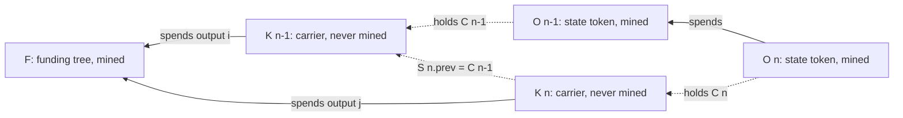
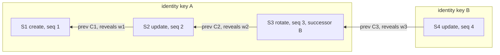

# The committed record

The substrate for an application that keeps state in an overlay: a terse mined
commitment, a record that lives in overlay storage, delivery by the multicast
object plane, and unicast serving on lookup. Finger is its first instance.

The design in one paragraph: the record is not stored in a locking script. The
on-chain part is as terse as possible while still binding every byte the
overlay holds, in one record or amalgamated across many. Each state transition
proves possession of the previous state. The plane distributes records to every
overlay, data is served publicly by unicast, and domain lookups point at the
overlays (BRC-180). **The record is a BEEF object**: it rides the plane as an
unmined carrier transaction, submitted through the same overlay submit door as
any object, so nothing that already carries BEEF has to change to carry a
record.

This is the normative specification. The same objects and flows are drawn in
[flows.md](flows.md).

## 1. Objects

| Object | Where | What |
| --- | --- | --- |
| **Record** `S` | inside a carrier | the state: canonical bytes, §2 |
| **Carrier** `K` | plane object (BEEF), overlay storage, never mined | one unmined transaction whose output 0 carries `S` |
| **Commitment** `C` | the token's script | `C = txid(K)`, 32 bytes, hash byte order |
| **State token** `O` | mined, plane object (BEEF) | PushDrop `[tag, C]`, 1 satoshi; each transition spends the previous token |
| **Funding tree** `F` | mined, plane object (BEEF) | one transaction with `M` tagged outputs (16 of 1 satoshi by default); each carrier spends one |

A subscript numbers the transition: `S_n`, `K_n`, `C_n` and `O_n` belong to the
n-th record of an identity. Each record also carries a witness commitment
`wc = SHA-256(w)`, where `w` is a secret the owner keeps outside the record
(§4.2).



Time runs left to right. Solid arrows are spends; dotted arrows are
commitments by hash. Per transition the plane carries two objects, `O_n` and
`K_n`, both BEEF and both admitted by the same topic manager; one transaction
is mined per transition, plus one per funding tree. "Mine the state, not the data."

## 2. The record

A CBOR map with integer keys, in the core deterministic encoding of RFC 8949
§4.2.1. Both codecs enforce it on encode AND decode: a non-canonical record is
refused. The CBOR subset is unsigned and negative integers, byte strings, UTF-8
text strings, arrays, maps, `false`, `true` and `null`; tags, floats,
indefinite lengths and nesting deeper than 16 are refused. Canonical encoding
is not what binds the record, though: the carrier's txid commits to the exact
bytes pushed.

| key | field | type | note |
| --- | --- | --- | --- |
| 0 | `magic` | bytes(4) | `"bfr"` + version `0x01`. The version is what lets this table change |
| 1 | `identityKey` | bytes(33) | the subject, a compressed key (`02`/`03`). **Not on chain** |
| 2 | `seq` | uint | `1` on kinds 1, 5 and 6; each transition is the previous `seq + 1` |
| 3 | `kind` | uint, 1 to 6 | `1` create, `2` update, `3` rotate, `4` retire, `5` sub-record, `6` manifest (§4.3, §5) |
| 4 | `prev` | bytes(32) | `C_{n-1}`, the previous carrier's txid in hash byte order; all zero on kinds 1, 5, 6 |
| 5 | `salt` | bytes(32) | random. Keeps `C` hiding even if the signature is deterministic (§3) |
| 6 | `wc` | bytes(32) | `SHA-256(w_n)`, the witness commitment (§4.2) |
| 7 | `prevWitness` | bytes(32) | `w_{n-1}`, revealed. Present on kinds 2, 3, 4 only |
| 8 | `notBefore` | uint | unix seconds; 0 = unbounded |
| 9 | `notAfter` | uint | unix seconds; 0 = unbounded. When both are non-zero, `notBefore <= notAfter` |
| 10 | `body` | map, text keys | the profile. Encoded size at most 16 KiB (16384 bytes) for kinds 1 to 4, 64 KiB (65536 bytes) for kinds 5 and 6 (§5) |
| 11 | `refs` | array | store entries `{name, root, count, head?}`, at most 64, §5. May be empty |
| 12 | `successor` | bytes(33) | rotate only: the next identity key, compressed |

Keys 0 to 6 and 8 to 11 are required on every record. Integer keys above 12
are unknown to this version: any party that re-encodes a record preserves them
and any party that reads one ignores them (BRC-174 §3.2's rule; a
reconstruction that drops a field destroys a future extension invisibly).

## 3. The carrier and the commitment

The finger derivations are BRC-42/43 under protocol `[1, "bfinger"]`, with key
ids `"profile"` (the token) and `"record"` (the carrier and the funding
outputs), invoice numbers `1-bfinger-profile` and `1-bfinger-record`. The owner
locks with counterparty `anyone` and `forSelf = true`; a reader derives the same
key from the identity key alone. Below, `derive(id, "record")` is that key.

`K_n` is a transaction with:

- **input 0**: spends one output of a funding tree `F`, locked to
  `derive(identityKey, "record")`. `nSequence = 0`.
- **output 0**: PushDrop `[S_n]`, lock-before, under the same key, with the
  field signature `Lock` appends (a DER signature over `SHA-256(S_n)` as
  pushed). It carries the whole value of the funding output it spends, so the
  fee is zero; the value is not fixed at 1 satoshi, since a tree may be minted
  with larger outputs.
- **`nLockTime = 4102444800`** (2100-01-01T00:00:00Z). With non-final inputs
  the transaction is not mineable before then: BRC-60's non-final device, used
  here to keep the record OFF the chain.
- **fee 0**. SPV requires only `sum(outputs) <= sum(inputs)`, and the engine
  passes no fee model (§12).

The field signature is what the topic manager verifies; the input signature is
what SPV verifies, a second proof of authorship for free.

`C_n = txid(K_n) = SHA-256d(bytes(K_n))`, carried in hash byte order (the
reverse of the display hex). It is binding by construction: a different record
is a different transaction. It is hiding because `salt` is inside `S_n`: even
with an RFC 6979 deterministic signature and a known funding outpoint, an
observer cannot recompute the txid of a guessed low-entropy record. Using the
txid means the plane, the engine's storage and the lookup answer already key
the record; there is no second hash and no second table.

Rejected: `C = H(S) XOR m` with `m` in the overlay is hiding but **not
binding** (anyone opens `C` to any `S'` with `m' = C XOR H(S')`, so a host could
substitute records that verify). `C = H(S)` alone is binding but not hiding for
a guessable profile. `C = H(S || salt)` is both, and is what the txid gives
once `salt` is a field.

**Funding outputs are tagged.** Each output of `F` is PushDrop `["bf" + 0x02]`
with no signature under the record key, so the script is
`<record key> OP_CHECKSIG <"bf" 0x02> OP_DROP` and is spent by the single
signature a bare pay-to-public-key takes. The tag lets a host admit funding
outputs without admitting every pay-to-public-key on the plane, and admitting
them is what makes the kill switch visible.

**Kill switch.** A transaction that spends a funding output a carrier spent
makes that carrier a double spend; once it is mined, every copy of the carrier
is permanently invalid. The owner's kill is one sweep per funding tree,
spending every output, used and unused, published to the topic like any object.
A host that admitted the tree sees the second spend and retracts the identity
(§7). The sweep's output 0 is a **tombstone**, a funding-shaped output carrying
the swept value (less the fee when no separate fee input pays it). It is there
because a host records a spend of an admitted output by the spender's admitted
outputs: a sweep that admits nothing is seen while the host runs but not after
a restart, and one that admits its tombstone leaves the kill in storage.

Kill and retire are separate: retire is a record that says "stopped" and stays
servable (§4.3); kill is a spend that makes every record the trees funded
unservable.

## 4. Transitions

### 4.1 Binding

`S_{n+1}.prev == C_n`, and the state token `O_{n+1}` spends `O_n`. The chain of
records and the chain of tokens are both unforgeable and anyone can check
either (BRC-60, BRC-107/108, BRC-168 §3.3 shape).

Records are not chained by spends (a carrier spending the previous carrier's
output), because that would grow every BEEF's unmined ancestry linearly.

### 4.2 Possession

A served record is not a secret, so knowing `S_n` proves nothing. Each record
therefore commits to a secret it does not contain: `S_n.wc = SHA-256(w_n)`,
where `w_n` is 32 random bytes the owner keeps **outside the record and never
serves**. The next record reveals it, `S_{n+1}.prevWitness = w_n`, and a
verifier checks `SHA-256(S_{n+1}.prevWitness) == S_n.wc`.

Producing `S_{n+1}` therefore needs the spend key (to spend `O_n` and sign
`K_{n+1}`) **and** `w_n`: two factors that can live in two places. Handing
`w_n` to a party authorises exactly one next transition, and the spend still
needs the key, so this is not a delegation mechanism (§5).

### 4.3 Kinds

Every record satisfies its kind's own shape; a transition (kinds 2 to 4) also
satisfies the chain rules against the current state: `prev == C_{n-1}`,
`SHA-256(prevWitness) == wc_{n-1}`, `seq == seq_{n-1} + 1`, and its token
spends `O_{n-1}`.

| kind | own shape | rule |
| --- | --- | --- |
| 1 create | `seq = 1`, zero `prev`, no `prevWitness`, no `successor` | the identity has no state yet; the token spends no token |
| 2 update | `seq >= 2`, non-zero `prev`, `prevWitness`, no `successor` | the chain rules |
| 3 rotate | as update, plus `successor` | the chain rules. The rotation record is signed by the current key. The NEXT record carries `identityKey = successor`, continues the chain (`prev`, witness, `seq + 1`), has its token locked to the successor's profile key (spending the rotation token, which the current key signs), and its carrier is funded from a tree under the successor's record key. Readers re-pin on a verified rotation |
| 4 retire | as update, empty `body` | the chain rules; terminal. The host keeps answering with the retirement record, which is how a reader learns the identity is retired rather than absent; the token is never spent again and the host refuses any later transition. Dropping the records is the kill switch's job (§3) |
| 5 sub-record, 6 manifest | as create | never a transition (§5) |



Arrows point from a record to the one it follows. `S1` to `S3` are funded
from A's tree and their tokens are locked to A's profile key; `S4`'s token is
locked to B's profile key and spends `S3`'s token, and `S4` is funded from a
tree under B's record key.

## 5. Amalgamation: one commitment over many stores

`refs` names other stores. Each entry commits to a Merkle root over the
commitments (carrier txids, hash byte order) of that store's members, RFC 6962
domain-separated: `leaf = SHA-256(0x00 || txid)`,
`node = SHA-256(0x01 || left || right)`, split at the largest power of two
below the leaf count (BRC-220 batch shape). The mined `C_n` binds `S_n`, which
binds every root. Store members are themselves carriers, so the plane carries
one object kind.

**Store records have their own kinds.** A member is a record of `kind = 5`, a
manifest one of `kind = 6`. Both are create-shaped, signed under the same
identity and funded from the same trees. A host indexes them and answers them
by commitment (§14.3) and never advances an identity's state on either. A
create-shaped member without its own kind would be a second create: refused
live, and on a restart (which replays carriers by sequence, ties by commitment)
able to take the chain start and orphan every real transition behind it. The
manifest's kind is distinct so that "the head is a manifest" is checked rather
than inferred from the count, and stays visible if a body is ever sealed.
bfinger writes a member's body as one text field named after its store.

**The body bound follows the kind.** A transition is delivered to every reader
of the identity and is bounded at 16 KiB encoded; a member or manifest is
fetched only by a reader that wants it and is bounded at 64 KiB. That number
follows the plane's minimum path MTU: at the 1280-byte IPv6 floor a 64 KiB
object is 59 fragments, about where the repair curve turns, and it rises when
the minimum path rises. Both codecs apply the bound by kind on encode AND
decode, so a record minted elsewhere cannot carry a store's body under a
transition's kind.

**The refs entry.** A map of the members `name` (text, 1 to 64 bytes, unique
within the record), `root` (bytes(32)), `count` (uint) and optionally `head`
(bytes(32), a commitment in hash byte order). A root cannot be inverted and the
host holds no root-to-member index, so an entry without `head` is committed to
but not discoverable from the record. With `head`, the reader asks the host for
that one carrier and proves membership itself:

- **`count = 1`:** `head` IS the member and the root is exactly `leaf(head)`,
  so membership is one hash.
- **`count > 1`:** `head` is the manifest. The manifest is not a member: the
  root is over the members it lists, in order. A reader verifies the manifest
  as a carrier, recomputes the root from the commitments it lists, requires it
  to equal the entry's root, then fetches and verifies each member as a carrier
  in its own right (the manifest says which commitment, not what is under it).
- **`count = 0`** commits to nothing, and a reader refuses it, as it does a
  `count` above 1024.

No inclusion path is carried. With the whole member list in hand, recomputing
the root proves more than a path per member: that the list is complete and in
order, which is what makes concatenating the members safe. A different order is
a different root. Inclusion paths remain for proving one member to someone who
does not have the list.

**Unknown entry members are preserved, and that one store is refused.** An
entry has 3 to 8 members, all with text names. A reader keeps a member it does
not define verbatim, so relaying a record does not strip it, and reports that
store as unsupported, because an unknown member may change how membership is
computed. The record and every other store are unaffected. (A strict entry
width would cost every older reader the whole record over one new store
field.)

**Manifest body.** Exactly one key, `members`: an array of 1 to 1024
fixed-width maps `{c: bytes(32), name: tstr, size: uint, type: tstr}`, all four
keys always present (an optional key would give one member two encodings). `c`
is the member's commitment in hash byte order; `size` its content length, so a
reader can refuse a store larger than it wants before fetching; `type` its media
type; `name` labels the part and may be empty. `name` and `type` are each at
most 64 bytes. A member costs 55 encoded bytes plus its name and type, so the
64 KiB bound, not the count, usually limits a manifest (about 880 members with
real names and types). A publisher sizes the manifest before minting any
member, since failing afterwards would leave every member on the plane with
nothing committing to it.

A store is replaced by publishing new members and a new entry; the old carriers
stay on the plane, unreferenced. A kill retracts a store's carriers with the
identity.

**Planned stores (not built).** Store names are the publisher's choice. Three
conventions are designed:

- `links`: members `{rel, href}`, keeping the primary record small on a metered
  plane (BRC-174 §3.3: reference what changes often).
- `grants`: `{delegateKey, scope, notAfter}`. **Delegation lives here, not in
  the record.** A delegate publishes its own chain (its own tokens and carriers,
  under its own key) whose records carry `principal = identityKey`, the grant,
  and the grant's inclusion path against the principal's current `grants` root.
  Revocation is a new principal state whose `grants` root omits the grant. No
  revocation outpoint, nothing in the principal's token, parallel by
  construction; BRC-169 §9's scope grammar fits `scope` unchanged.
- `media`: `{contentType, uhrp}`, BRC-26 identifiers, fetched from wherever
  UHRP resolves them.

## 6. What the plane carries

Per transition, `O_n` and `K_n` (the carrier with its funding parent's ancestry
inside its BEEF), published to `tm_finger` through the same submit door as any
object; per `M` records, one funding tree. Arrival order is unconstrained (§7).
Every object is delivered to every subscribed host and billed as delivered
bytes.

A mined transaction (`O_n` or `F`) is published either with its BUMP, or before
it mines with its unproven ancestry down to proven transactions, which is what
an unmined transaction can show and what a host and a reader verify it by (§10
step 3 answers `VERIFIED-UNMINED`). In the second case the publisher publishes
it again once it mines, now carrying its BUMP. Those are different bytes, so the
plane delivers them like any other object, and each host verifies the path
against its OWN headers before upgrading the copy it holds. A path naming no
block the host knows is refused, which makes the proof safe to take from
anyone. Upgrading a funding tree also upgrades every carrier that spent it.

## 7. The host

**Topic manager** (`tm_finger`) admits each output on its own validity:

- **token**: a lock-before PushDrop of fields `[tag, C, signature]` with
  `tag = "bf" + 0x01` and `C` 32 bytes, whose field signature (over
  `SHA-256(tag || C)`) verifies under the locking key. Nothing else: the
  manager cannot check the lock derivation, because the identity key is not in
  the token, and it does not check the spend, because a token whose predecessor
  has not arrived is early, not invalid. Both checks are the lookup service's.
- **carrier**: exactly one record output, a lock-before PushDrop `[S,
  signature]` whose `S` is a CBOR map with the known `magic` (other PushDrops
  are skipped; two record outputs refuse the carrier); `S` decodes and passes
  its kind's own shape (§2, §4.3); `nLockTime >= 4102444800` and every input's
  `nSequence < 0xFFFFFFFF` (a mineable carrier is refused, since the record
  could reach the chain); the locking key equals
  `derive(S.identityKey, "record")`; the field signature over `SHA-256(S)`
  verifies under it.
- **funding output**: exactly PushDrop `["bf" + 0x02]` with no signature, in
  any transaction, so that a later spend of it is seen.
- **spend**: a transaction with nothing finger-shaped among its outputs that
  spends outputs the topic holds (such as a sweep) is accepted for its inputs
  alone.

Every previous coin is retained (`coinsToRetain`), even when the spending
object is refused, so a carrier's funding output stays in storage marked spent
by the carrier. Refusals are counted by `finger_refused_total{reason}`.

**Lookup service** (`ls_finger`) is the join and the enforcement point:

- It indexes tokens and carriers by commitment, hex in HASH byte order (the
  order `C` is carried in, the reverse of the engine's display txid). Tokens
  are kept as a list per commitment: a commitment is public, so anyone can mint
  a valid token over it, and the join takes the one locked to the identity's
  profile key. A token with no carrier yet is *pending*; each admission
  attempts the join, and a transition that arrives before its predecessor joins
  when the predecessor does.
- Kind 5 and 6 carriers are indexed and answered by the carrier question, are
  dropped by a kill, and never join or advance a state.
- **The join** checks, in order: the identity is not killed; the record passes
  its own shape; the token is locked to `derive(S.identityKey, "profile")`;
  then, for a create, the identity has no state; for any other kind, the
  current state exists, is not retired and has not rotated away, and the chain
  rules hold (§4.3), including that the new token spent the current token. A
  rotation whose successor already has a state is refused. A join that fails
  **does not become current**: the previous state stays current and the failure
  is counted (`finger_join_failures_total{reason}`). On a verified rotation the
  successor's current state is the rotation record.
- **`lookup({identityKey})`** answers an output list: the current token, the
  current carrier, and the previous carrier where one exists, so a reader can
  check the witness. A create has no previous carrier, so the answer is two
  outputs rather than three, and a reader must not treat it as incomplete.
  `lookup({identityKey, pending: true})` also lists tokens locked to that
  identity's profile key whose carrier has not arrived. The engine hydrates each
  outpoint as BEEF; the record is inside the carrier's BEEF. `context` is not
  needed.
- **Kill**: the service records the outputs every carrier spends. When any of
  them is spent by a txid other than that carrier (a spend notification, a
  second carrier claiming it, or the input of any admitted transaction, which
  the service reads itself so that a host holding a sweep without the outputs
  it spent still sees the kill, in any arrival order), it kills the carrier: every state the carrier is
  part of, and every carrier of that identity with its tokens, is dropped;
  the identity answers nothing afterwards, pending and carrier questions included;
  and late tokens or carriers of it are refused (`finger_killed_total`). The
  chain keeps the hashes; the host keeps nothing it would have to serve.
- **Restore**: storage is the engine's own `outputs` table (the carrier's BEEF
  holds the record). On start the index is rebuilt from the topic's unspent
  outputs; each carrier's funding outpoints are re-read from storage, and one
  consumed by any txid other than its carrier is a kill, so a kill survives a
  restart. Carriers are then advanced in ascending `seq` (ties by commitment)
  on the chain rules alone, since spend links are not replayed and spent tokens
  are not among the rows; a state whose current token was not restored answers
  without it. A host that joins late (for example by catching up from a peer)
  holds only each identity's current token, so after a burst of `no-current`
  refusals settles it re-derives every chain from its carriers the same way.
- **The host MUST NOT call
  `maintainUnprovenTransactions`/`evictUnprovenTransactions`**: carriers are
  unproven by design.

## 8. Discovery and serving

`https://<domain>/manifest.json` carries `metanet.overlays.ls_finger` and
`metanet.overlays.tm_finger` (BRC-180) and the BRC-169 `metanet.handles`
resolve endpoint that maps a name to an identity key (§10 step 1). Serving is
BRC-24 `/lookup` by unicast; a host may rate-limit or 402-gate it
(BRC-105/121/166) with no change to the record (§14).

## 9. Sensitivity

The chain holds, per transition, a token with a derived locking key and a
hiding commitment, and per funding tree, outputs under a derived key; nothing
else. The record exists only in the carriers hosts hold. Hosts serve on request
and can decline, rate-limit, charge or delete. The kill switch (§3) makes every
retained copy of a carrier invalid after one mined spend: a host that admitted
the funding tree sees the double spend and drops the records, and a reader that
asks afterwards gets no token. SPV alone cannot show a spend, so a reader that
must decide a carrier's standing without a host would consult a UTXO index
(BRC-169 §4.2 makes the same concession); that check is a seam, not built.

## 10. Reader verification, in order

1. Resolve the name to an identity key: the domain's `/manifest.json` names a
   BRC-169 resolve endpoint (`metanet.handles`) and the overlay host that serves
   the identity (`metanet.overlays.ls_finger`, BRC-180, unless a host is
   configured).
2. `/lookup` at that host; refuse anything but `output-list`. When several
   hosts are asked they must agree byte for byte (`REFUSED-FORK`). The answer
   must hold exactly one state token (none: `NO-TOKEN`; several:
   `REFUSED-FORK`).
3. Token BEEF: decode `[tag, C]`; SPV against the reader's own header source
   (`header_url`; see [configuration.md](configuration.md#header-sources)).
   A token with no proof yet verifies through its ancestry and the result is
   `VERIFIED-UNMINED` rather than `VERIFIED`.
4. Carrier: the served carrier whose txid is `C` (none: `RECORD-PENDING`); SPV
   through its funding parent; decode `S`; its kind's own shape; unmineable;
   locking key `derive(S.identityKey, "record")`; field signature.
5. Token: locking key `derive(S.identityKey, "profile")`; field signature.
6. Pin: `S.identityKey` equals the key the name resolved to; a retired pin
   refuses (`REFUSED-RETIRED`); the key matches the known-keys record, or this
   is first contact, or the key changed through a verified rotation (the
   previous record is a rotate, by the pinned key, naming this key).
7. `S.seq >= pinned seq`. Unless `S` is a create: the previous carrier (txid
   `S.prev`) is served (`REFUSED-COMMIT`), `S.seq` is its `seq + 1`,
   `SHA-256(S.prevWitness)` equals its `wc`, and it names the same identity or
   is a rotation to this one.
8. `notBefore <= now <= notAfter`, each bound 0 = unbounded, with a clock skew
   allowance (120 seconds by default).
9. `refs`, once the record verified. For each entry with a `head`, ask the host
   for that carrier (§14.3), check `txid == head`, then the carrier as in step 4
   and that it names the same identity. Then, by count: `count = 1`,
   `leaf(head) == root` and it is a `kind = 5` record; `count > 1`, it is a
   `kind = 6` manifest listing exactly `count` members that rebuild `root`, and
   each member is fetched and checked the same way as a `kind = 5` record. A
   store that fails is reported in its place and does not refuse the record: a
   store is content the record commits to, not a condition of it.

Signatures and derivations (steps 4 and 5) come before the pin (step 6): never
decide who should have signed and then look for a matching signature.

## 11. Frozen at first publish

Changing any of these after the first mint orphans every record:

- the PushDrop counterparty and self setting, `anyone` with `forSelf = true`,
  the only pair under which a reader holding the identity key alone can
  recompute a locking key AND the embedded signature verifies under it; the
  lock-before layout;
- the derivations `[1, "bfinger"]` / `"profile"` and `[1, "bfinger"]` /
  `"record"`;
- the token tag `"bf" + 0x01`, the funding tag `"bf" + 0x02` and the record
  `magic` `"bfr" + 0x01`;
- the CBOR key map (§2);
- `nLockTime = 4102444800`;
- the RFC 6962 leaf and node prefixes.

Frozen by the first store published:

- the kind numbers `5` and `6`;
- the entry member names `name`, `root`, `count` and `head` (a later version
  may add members but not redefine these);
- the manifest's single body key `members` and its member field names `c`,
  `name`, `size` and `type`;
- that a store's root is over its members in manifest order and never over the
  manifest; that `count = 1` means `head` IS the member and the root is
  `leaf(head)`, while `count > 1` means `head` is a manifest; and that a
  member's leaf is the hash of its commitment alone, which makes a linked store
  enumerable.

Frozen by the lookup service (§14):

- the classes `{identityKey}` and `{identityKey, pending}` are free on every
  conforming host, for as long as `ls_finger` answers at all;
- the member name `carrier` in the priced class;
- that an unknown `query` member is refused rather than ignored, because
  relaxing it later would create priceable aliases of a free class.

The 64 KiB store bound is NOT frozen: raising it is a coordinated deploy of the
reader, the host and §2.

## 12. Facts this design rests on

Verified against the pinned versions:

- `@bsv/sdk` `Transaction.verify` → `verifyUnminedTransaction`: verifies input
  source scripts and `sum(outputs) <= sum(inputs)`; `verifyTransactionFee`
  returns immediately when `feeModel === undefined`; no `lockTime`, `nSequence`
  or finality check anywhere in the verify helpers (`lockTime` reaches only the
  script interpreter). The Go SDK's SPV path reads no finality either.
- `@lightwebinc/overlay` 2.3.1 `Engine.submit` calls
  `tx.verify(this.chainTracker)` with no fee model. Eviction of unproven
  outputs is opt-in: `evictUnprovenTransactions` is reached only from
  `maintainUnprovenTransactions`, which the host never calls;
  `unprovenEvictionBlocks = 144` is only the default threshold of those
  maintenance methods.
- The plane's ingress and the bridge's feed check the object's leading BEEF
  marker and its size only; nothing requires the subject transaction to be
  mined.
- The engine exposes `offChainValues` and `LookupFormula.context`; this design
  needs neither, because the record travels inside a BEEF.

## 13. Payments, and the directions to keep open

Operators that pay to receive data must be able to monetise their own audiences
directly; payments to individuals do not ride a one-to-many transmission
mechanism; the incentive to place data on the fabric is the value of the data
itself. For this substrate:

- the plane carries carriers and tokens, never payments; a payment is bilateral
  and unicast (BRC-29 into the identity's messagebox, a 402 on `/lookup`, a
  subscription output);
- a host's revenue is from its readers (BRC-105/121/166 on the lookup route,
  BRC-178 across competing hosts, sub-satoshi channels below one satoshi), not
  from the publisher or the plane;
- a publisher's reason to publish is reach and verifiability, so a record must
  stay cheap to place (one mined token per transition, one funding tree per `M`
  records) and expensive to fake;
- `bfinger pay` derives a BRC-29 destination from the identity key with no
  change to the record.

Seams left open: a 402 handler position on the host's lookup route; a reserved
`body` key for a group-keyed private field (key-graph broadcast encryption to
subscribers, with renewal as a spend of the member's output); a reserved `body`
key for per-field commitments with scoped reveals; an optional operator-paying
output slot in the token transaction (pay-to-publish).

## 14. Optional monetization

Two different things are called monetization. A **restriction** is a property
of bytes: it survives copying, and over a one-to-many plane only encryption
produces one. A **service fee** is a property of a socket: it binds one reader
to one host for one answer. This section specifies the service fee, states the
invariant that keeps the directory free, and says where a restriction would
come from; neither may be presented as the other. Every part is optional: a
publisher that declares nothing, a host that charges nothing and a reader with
no wallet are the default, not a degraded configuration.

### 14.1 What a price on a lookup can sell

The plane delivers every carrier to every subscribed host, and peer sync serves
the same outputs to any peer without authentication (they disclose exactly what
`/lookup` does). A reader refused at one host can ask another, or sync the
topic itself. So a price on a lookup route sells availability, latency,
retention and convenience, never exclusivity; BRC-178 says the same of a
network of hosts.

Presenting a priced lookup as restricted access is wrong (BRC-190 section 9,
BRC-369's motivation). A priced lookup MUST NOT be called a "gate" in BRC-190's
sense: a gate is evaluated by the reader against public facts and constrains
no non-conforming client, whereas a priced route authenticates, is evaluated by
the host, and constrains every client absolutely.

### 14.2 The free base answer

**Invariant.** A price attaches to a question CLASS, never to part of an
answer. A class is the set of member names in the BRC-24 `query` object. The
classes `{identityKey}` and `{identityKey, pending}` are priced zero on every
conforming host, and their answers are byte-identical on a host that charges
for nothing and one that charges for everything else.

Three supports, strongest first:

1. **Structural.** Priced material is a different question (§14.3), so nothing
   is subtracted from the base answer to make a paid tier, a short answer never
   has to be told apart from data loss, and the base answer's bytes stay stable
   across a mixed fleet, which a reader comparing hosts depends on.
2. **Mechanical.** No deployed lookup client can pay: clients treat a non-200
   as a refusal, so a 402 on the base question makes the directory unreadable,
   not expensive.
3. **Normative.** A host that prices the base class is out of specification
   (BRC-166 section 5.9 gives the reason for a discovery document; it holds
   with more force for a directory).

Two rules keep support 1 from being bypassed by a spelling:

- A priced class MUST NOT be a superset of a free class: `{identityKey, fast}`
  is not a licence to charge for the base answer.
- `ls_finger` MUST refuse a question carrying a `query` member it does not
  define (it defines `identityKey`, `pending` and `carrier`). Ignoring one would
  let any extra word make a priceable alias of a free class.

### 14.3 The priceable question

One class is worth pricing, and it is a different question rather than a subset
of an existing answer:

```json
{"service": "ls_finger", "query": {"identityKey": "<66 hex>", "carrier": "<64 hex, display order>"}}
```

It answers one carrier (in practice a store member or manifest) by its
commitment, from the carrier index the lookup service already keeps. Host
rules, all mandatory:

- the question names BOTH members: the identity scopes the answer and gives the
  kill switch something to check;
- the txid is converted to hash order before the index is consulted;
- a killed identity answers an empty list, exactly as the base question does
  (selling a record whose owner retracted it on chain is the one failure that
  turns an optional charge into a liability);
- a carrier whose recorded identity does not match the question answers an
  empty list;
- the answer is an ordinary `output-list`.

**The host asserts one thing only: that it holds this carrier under this
identity.** It holds no root-to-member index and cannot assert membership of
any store; membership is the reader's own check against the `root` in `refs`,
so a store's value does not depend on the host being honest.

### 14.4 The host declares its terms; the record never carries a price

No price, payee or revenue share goes in the record, for three reasons, each
sufficient: a price is the most frequently changing attribute in the system,
and embedding it costs one mined transition plus a plane-wide redelivery per
change (BRC-174 section 3.3); a price in a record is a claim by the subject
about an operator's conduct, which binds no operator; and the record is
delivered to every subscribed host and billed by the byte (§6), so every reader
would pay for bytes that concern one host.

A host that charges publishes its terms at its own route, resolved against the
base URL `metanet.overlays` already declares (§8). BRC-180 rule 2 lets a service
define its own routes and forbids respecifying them in the manifest, so no
manifest key is added and no host is probed. A host that serves no terms
document answers every question 200, which is the default.

### 14.5 Restriction is out of scope

Nothing here restricts anything. If a store's contents must be readable only by
parties who satisfy a condition, the mechanism is BRC-369: content encrypted
once under a key committed to before any recipient exists, published where
anyone can fetch it, with the key released per recipient against a stated
condition. It is not built here:

- **It needs parties this system does not have**: a messagebox to deliver a key
  to, and a releaser bounded by a delegation certificate.
- **It would seal the wrong things.** `grants` must stay readable for
  delegation to be verifiable by a third party (BRC-369 section 5.2.4 forbids
  releasing one key to a broadcast counterparty, and section 10 says not to key
  what must stay readable). `media` holds locators for bytes published in the
  clear. That leaves `links`, the least valuable store.
- **A declaration is not a mechanism.** A field saying "this store is sealed"
  is checkable only against bytes the record does not bind; it is worth adding
  only with the mechanism that makes it checkable.
- **The commitment already binds what matters.** `C` binds the record, which
  binds every root, which binds every member commitment; a future sealed store
  builds on that.

A publisher who needs a restriction now publishes the content as BRC-369
content and puts its content id in a member body: this system carries the
commitment, BRC-369 carries the restriction.

## 15. Open

- Grants for organisations at scale: a `grants` root re-published per change is
  one mined transaction per membership change; a sub-store with its own chain
  may be wanted.
- Store members share the primary record's funding trees, so a kill retracts
  them with the identity. A store meant to survive a kill, or to be retracted
  alone, would need its own tree.
- A store is public by construction: its leaf is the hash of a public txid, so
  a host holding an identity's carriers can match any root in its record by
  hashing what it already has. Content that must not be linkable needs a member
  encoding that carries a secret.
- A member carries its content inline. A member that names content held
  elsewhere (a BRC-26 UHRP locator, a BRC-167 chunk tree) is the shape for
  anything past what the plane should carry, and `type` is where it would be
  declared.
