# Flows

Every operation as a diagram, in the order things happen: a reader resolves a
name and checks an answer, an owner publishes, updates, rotates and retires, a
host admits and joins, and money moves. The rules are in
[committed-record.md](committed-record.md); the user's view is
[user-guide.md](user-guide.md). If you read one diagram, read
[4. Verification order](#4-verification-order).

| Letter | What it is |
| --- | --- |
| **S** | the record: the owner's claim, a few hundred bytes of CBOR |
| **K** | the carrier: the transaction that holds S in its output 0, never mined |
| **C** | the commitment: K's txid, the only thing about S that reaches the chain |
| **O** | the state token: a mined transaction carrying `[tag, C]`; each update spends the last |
| **F** | the funding tree: one mined transaction whose outputs the carriers spend, one each |
| **w**, **wc** | the witness, a secret the owner keeps, and `wc = SHA-256(w)`, which the record publishes |

**SEAM** marks what is designed and not built: the BRC-52 handle certificate
check, a messagebox for payment notices, delegation, the `grants` / `links` /
`media` sub-stores, hooks, host-side charging, and a reader-side spend check.
Keys, txids, addresses and host names below are illustrative.

## Reading

### 1. Resolution: an address to an identity key and a host

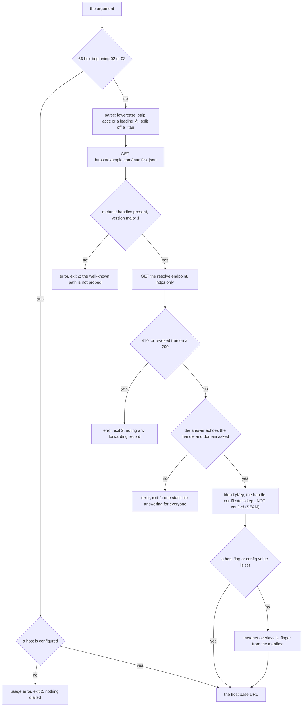

The manifest says which endpoint resolves handles and which host serves the
identity; the resolve endpoint says which key. The echo check catches a static
file that passes every other check. A bare identity key skips both requests,
so it needs `-host`. Both requests are HTTPS only, system roots, TLS 1.2
minimum, no environment proxy, same-origin redirects, 256 KiB bodies.

### 2. Header source

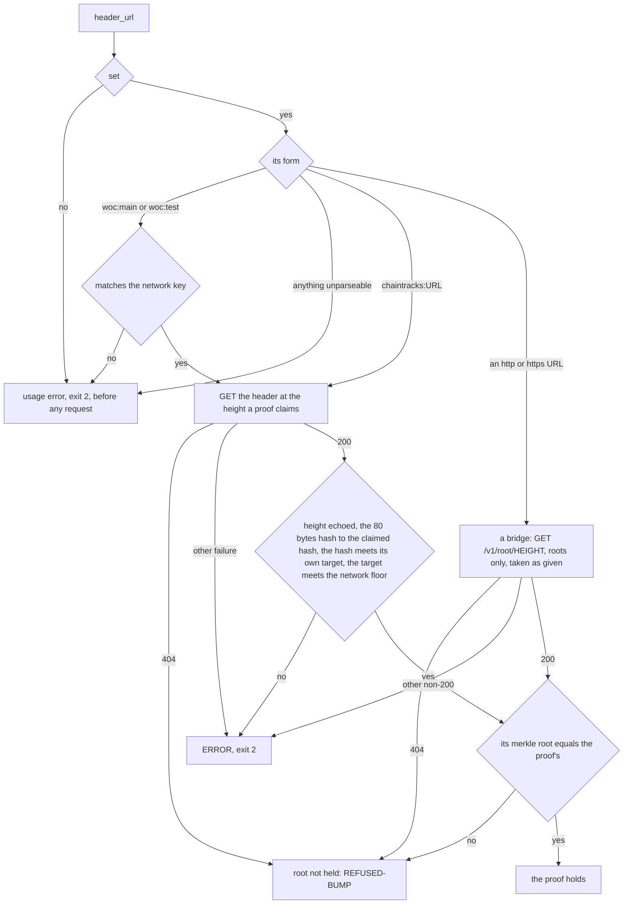

`network` is `main` (default), `test` or `regtest`. On `main` the floor is
difficulty 4e9, so a lying WhatsOnChain or chaintracks source must mine a real
block; `test` and `regtest` have no floor. A `woc:` source that names another
network, or a spec that does not parse, fails every command at startup with
exit 2. The same check runs for `receive` and `fund -txid`.

### 3. The read path, end to end

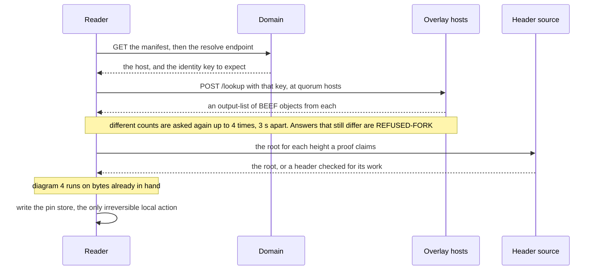

Each party answers one question. The header source is the one answer the
reader cannot check for itself, so an unreachable source is ERROR (exit 2),
never a refusal.

### 4. Verification order

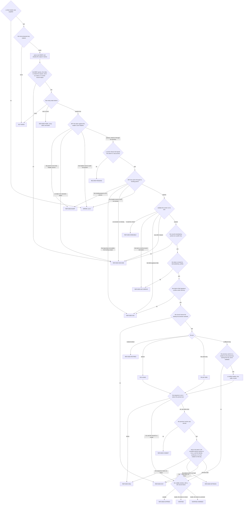

Signatures and derivations are settled before the pin is consulted, so the
reader never decides who should have signed and then looks for a matching
signature. A header source behind the chain lands on REFUSED-BUMP, not on a
wrong verdict. Exit codes: 0 for VERIFIED, 1 for every refusal, 2 for ERROR;
VERIFIED-UNMINED exits 0 for a lookup and 1 under `verify` (`-accept-unmined`
overrides). Deliberately not checked: that the token spends the previous
token, that the previous carrier is itself proven, that a retirement is
terminal, and anything about `refs`.

### 5. The pin store

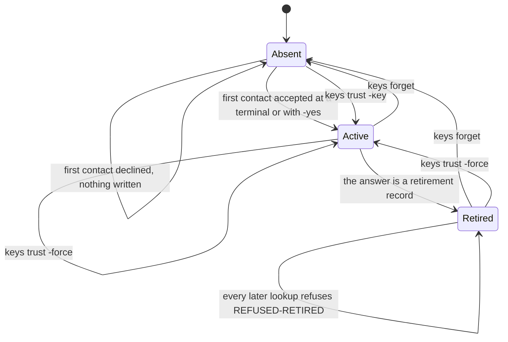

Without the pin a host could swap the key it answers with and every signature
would still verify. Nothing is written unless the run passed; the file is
written to a temporary file, fsynced, renamed, and the directory fsynced. A
`@rotated-from` line never satisfies a pin. A first contact that lands on a
retirement writes an ACTIVE pin, so the refusal appears two lookups later.

## Objects

### 6. Object shapes

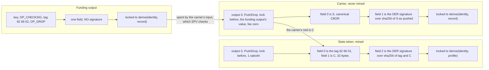

Each field signature covers only its own object. The carrier's input
signature is a second proof of authorship that SPV checks for free. The
funding tag lets a host admit these outputs without admitting every
pay-to-public-key, and admitting them is what makes the kill visible.

### 7. The commitment

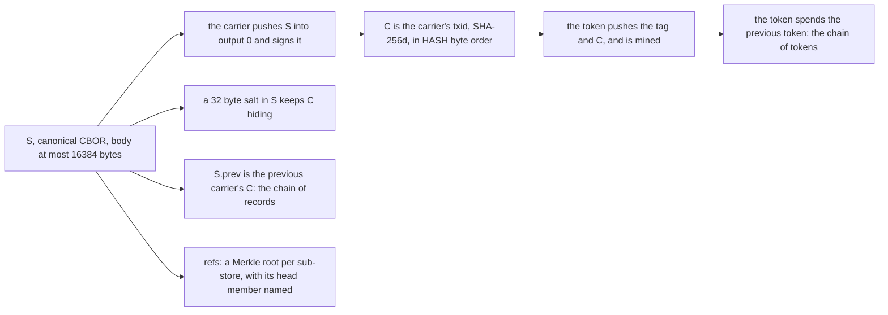

C is the hash byte order, not the display hex; a reader that reverses it
finds no carrier. A store with one member has that member as its head; with
more, the head is a manifest listing the members, and the reader rebuilds the
root from it before fetching any.

## Transitions

### 8. Create

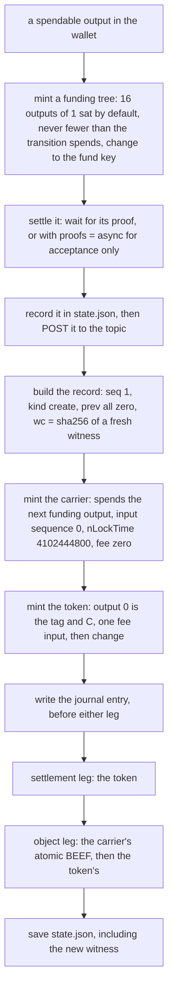

The tree is published so hosts hold its outputs; a host that never admitted
it is never told it was swept. `-store` sub-records are minted first from the
same tree. State is saved once the token is settled, before any object is
posted, so a failed post is recovered by `publish -resume`. Without `-yes`
everything is built and printed and nothing is sent (with `funding = wallet`,
refused instead).

### 9. Update

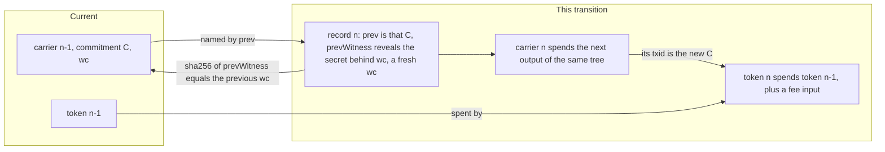

Both chains advance at once: records through `prev` and the witness, tokens
through the spend. The next record needs the spend key and a secret the
previous record committed to. Rotate adds a successor; retire carries an empty
body.

### 10. Rotation

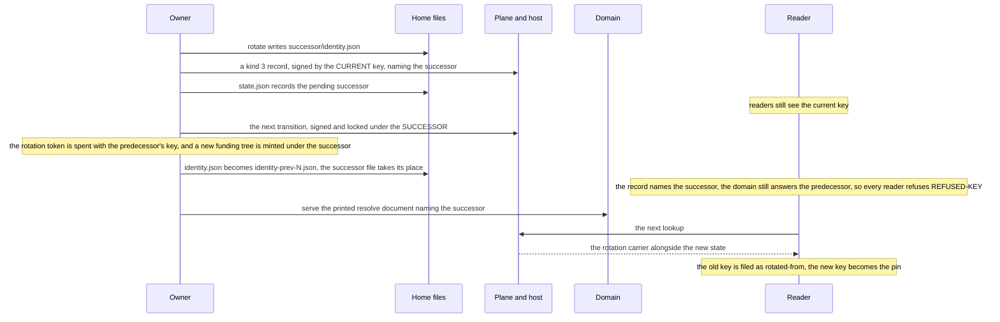

A reader re-pins only because the rotation carrier is served and validates on
its own. The predecessor's key file is kept because the wallet still holds
outputs locked to its fund key. A crash between the two renames leaves no
`identity.json`; do not run `bfinger init` (the next promotion would
overwrite the kept predecessor file), move the successor file into place by
hand.

### 11. Retire and kill

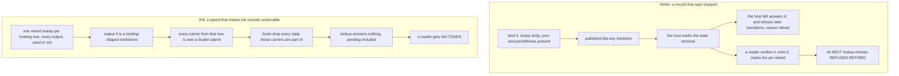

A retirement verifies and stays readable; a kill removes the ability to serve
anything, whoever holds a copy. A reader does not enforce terminality: an
update after a retirement verifies, and the host and the `@retired` pin stop
it.

## Publishing

A transition needs a submit endpoint (`facade`), a settlement leg (`settle`:
`tcp:`, `rpc:` or `arcade:`) and, except in the case of diagram 13, a node
(`rpc`, `asset`). None has a default; a missing one is a usage error before
anything is sent. `publish -resume` needs only a facade, `doctor` nothing,
reading none of them.

### 12. The two legs of a transition

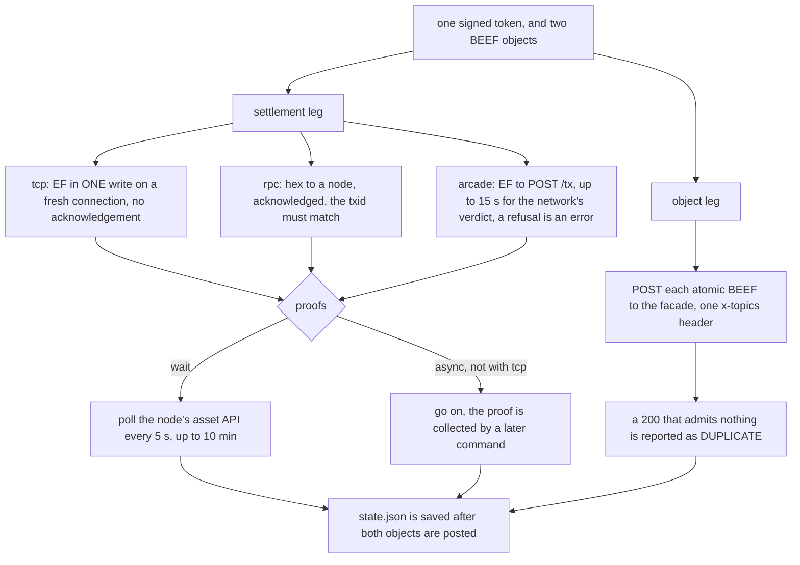

The legs never share a connection, and no function in `publish` accepts both
a transaction and a BEEF: the ingress locks a stream's grammar from its first
four bytes, so a BEEF on the settlement socket poisons it. The carrier is
never settled (it is unmineable). A facade 401 or 403 is named as an auth
refusal; any other non-200 fails the leg.

### 13. Publishing through arcade with no node

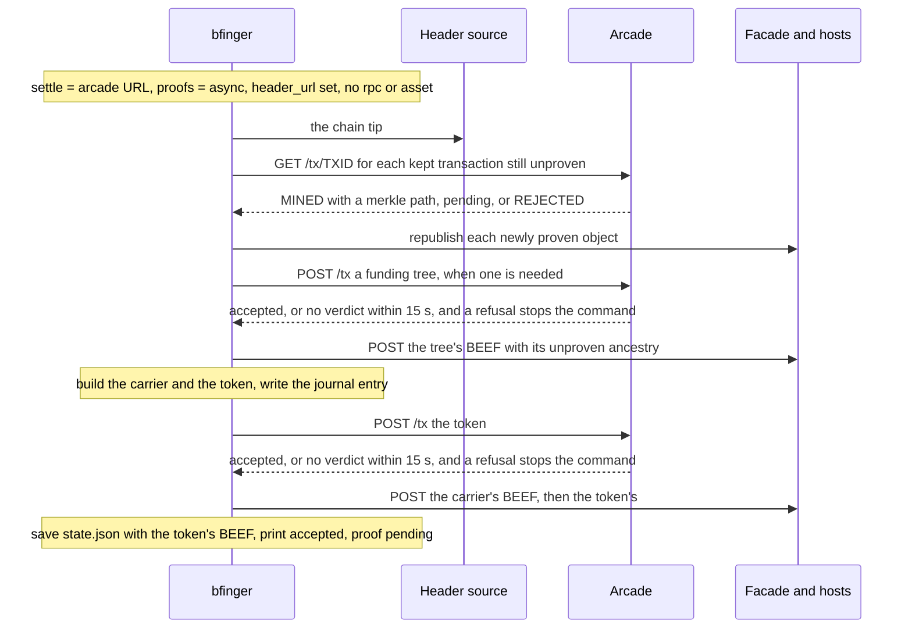

Any ARC service works. Without a node, `proofs = async` and `header_url` are
required (usage error otherwise). Arcade's proof is held to a node's checks: it
parses through the BUMP guard, names the transaction asked about, and agrees
with the reported height. Change from an unproven parent is held until the
parent proves. `pay` and `kill` wait for a block (polling the ARC service when
there is no node), but only after the payment's notice is written or the
sweep is recorded and posted; a wait that runs out keeps the coin spent and
holds the change until a later command collects the proof. Under
`proofs = wait`, a token whose wait runs out after it was sent continues as
`async` would: saved and published unmined. `funding = wallet` still needs a node, because the wallet
broadcasts through its own service.

## At the host

### 14. Admission: tm_finger

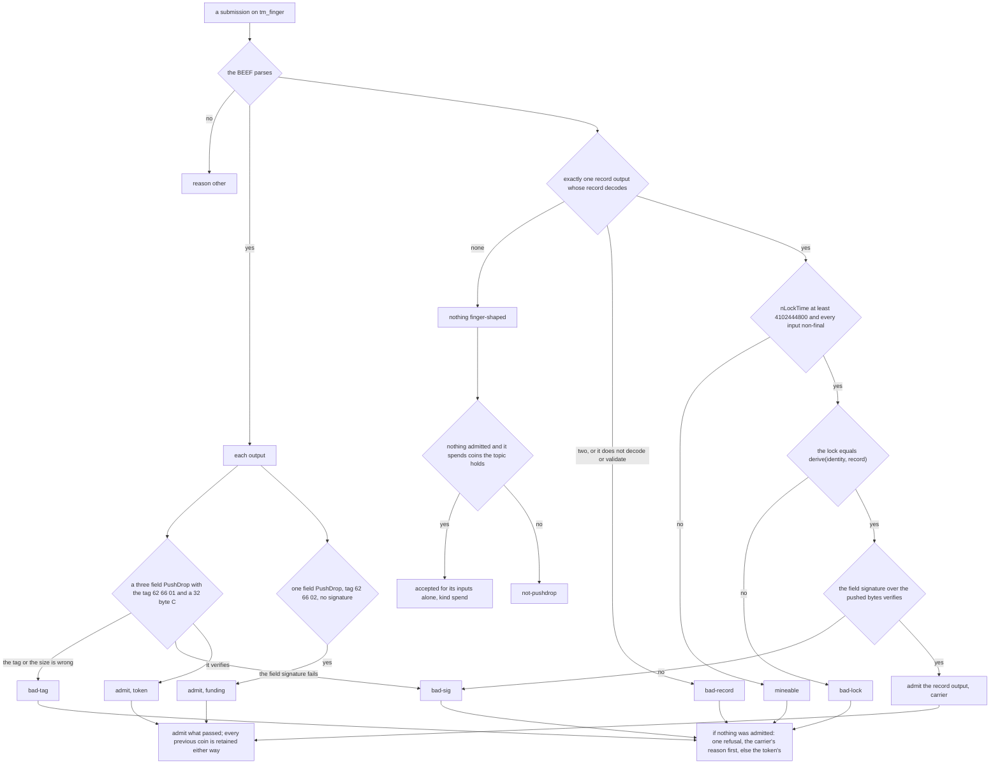

Each object is admitted on its own validity, without the previous state. The
token's lock derivation cannot be checked here (the identity key is not in the
token); the join does it. Previous coins are retained even when the spender is
refused, because the coin is spent on chain regardless and the kill depends on
that fact. The `spend` branch admits a sweep that creates nothing the topic
keeps.

### 15. The join: ls_finger

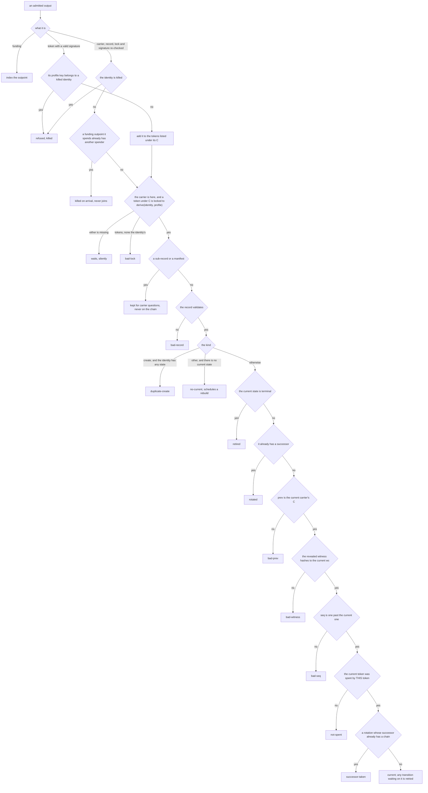

A failure never displaces what is current; it is counted under its reason in
`finger_join_failures_total`. Arrival order does not matter. Anyone may mint a
valid token over a public C, so tokens are kept as a list and the join takes
the one locked to the carrier's identity. A carrier that spends an outpoint
another carrier already claims kills that other carrier. A rotation to a
killed successor stands without handing it the chain. Queries: `identityKey`
(current token, current and previous carrier), `pending: true` (plus this
identity's tokens whose carrier has not arrived), and `carrier` (one carrier
of this identity, given in DISPLAY order); any other member is refused.

### 16. Catching up from a peer

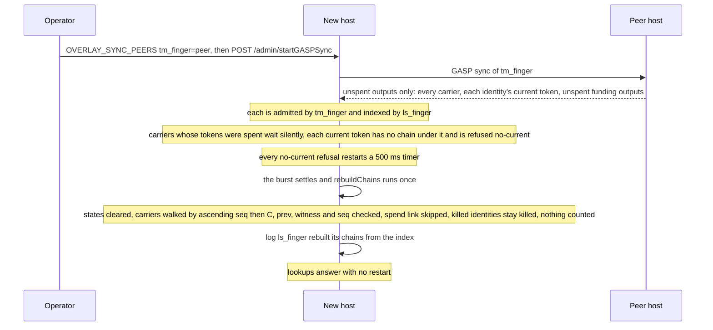

The walk is `restore`'s, run without reading storage. Kills arrive the same
way: a sweep's tombstone is an unspent topic output, so sync carries the
sweep, and the host reads its spends from the sweep's inputs, whatever order
the graphs arrive in (and again from the stored BEEF on a restart).

### 17. The kill, at the host

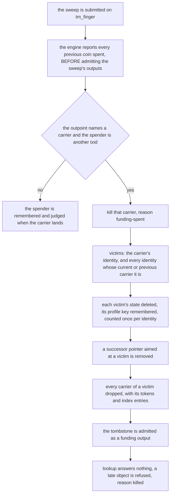

A rotation's successor is swept with the predecessor, because the rotation
carrier is its current carrier too. The tombstone gives the sweep an admitted
output, which is how the spend is recorded in storage and survives a restart.
A host that never admitted the funding tree is never told of the spend and
keeps answering.

## Payment

### 18. BRC-29 pay and receive

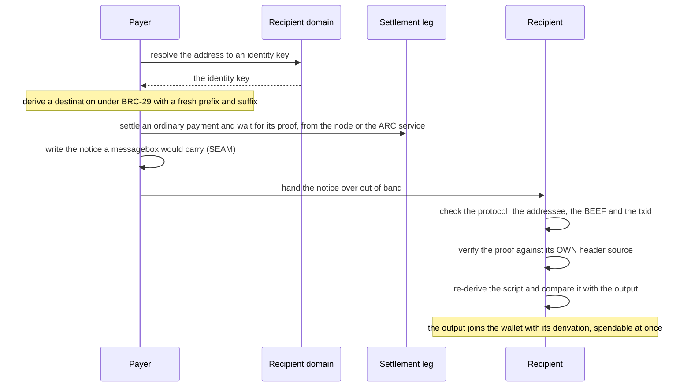

Nothing about the payment rides the plane. The notice is the only copy of the
derivation; losing it means the output cannot be added.

## Trust

### 19. What is trusted

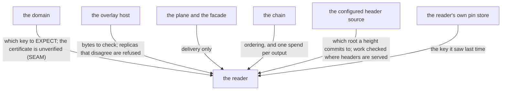

The reader believes only headers from a source it chose and a pin it wrote,
which is why `header_url` has no default. The pin bounds a domain that starts
answering a different key. SPV cannot say whether an output is spent, so a
reader with no host it trusts cannot see a kill (SEAM).
