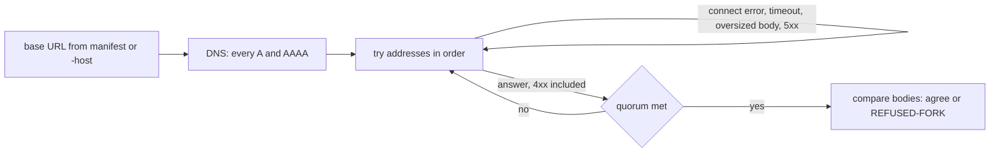

# Host selection

How bfinger picks which host answers a BRC-24 lookup, and what was left out.
The code is `hostset` (which address, under what policy) and `lookup` (the
client and the answer) in `github.com/lightwebinc/bcommon`, and
`internal/reader/lookup/` (bfinger's questions).

## 1. Every host is a replica

Hosts behind one name hold the same objects, delivered by the multicast plane
([BRC-148](https://github.com/bsv-blockchain/BRCs/blob/master/transactions/0148.md)) or copied by GASP catch-up. Each admits objects on their own validity, keeps
its own index and answers from it; there is no leader. The reader verifies
everything it is handed.

So choosing a host is an availability question, not a trust question. A host
that answers wrongly (stale, forked or malicious) is caught by verification:
the cost is a refusal and a retry, never a wrong result. That is what makes
simple load balancing safe.

## 2. The fan-out lives at the name

A domain's `/manifest.json` names one base URL per service
(`metanet.overlays.ls_finger`). BRC-180 rule 2 makes the base URL the whole of
what the manifest may say about reaching the service; the routes belong to
BRC-24. So the manifest lists one host, and the name in it resolves to as many
addresses as the operator likes:

- **Several A/AAAA records.** A client that reads the whole set has the whole
  replica list.
- **DNS routing policies** (multivalue, latency, geolocation, failover) answer
  with different subsets by client and by health. Health checks need a target
  the checker can reach; where hosts are not publicly reachable, plain
  multivalue records are the honest option and the client fails over itself.

Adding or removing a replica changes DNS only, never the manifest, the
protocol or the reader.

## 3. The client side

- **Resolve all addresses.** `hostset.DNS` returns every A and AAAA record; an
  IP literal yields itself. It is the only source the command uses. `-host`
  takes one base URL; given twice, the last wins. `hostset.Static` takes an
  explicit list, and no command path reaches it.
- **`PolicyFirst` with failover.** Try in order; a connect error, timeout,
  oversized body or 5xx moves to the next address. A 4xx is an answer: the
  host was up and said no, and asking the next replica would hide that.
  `PolicyRandom` shuffles first, spreading readers over replicas with no
  coordination.
- **`Quorum` for the fork check.** Replicas that disagree are refused
  (`REFUSED-FORK`), and disagreement is visible only by asking more than one.
  `Quorum N` requires N distinct addresses to answer, fails at once if the
  name resolves to fewer, and names each failing host. The caller compares
  the bodies: agreement is bfinger's rule, not hostset's. `PolicyAll` asks
  every address.
- **The Host header stays the name.** The hostname stays in the URL, the Host
  header and the TLS handshake; only the dialer connects to the chosen
  address, so certificate verification and virtual hosting work. Keep-alives
  are off, so two attempts never share a connection and one replica is never
  counted twice. Redirects are followed only within the origin, at most five.

`lookup.Query` POSTs a BRC-24 question through `hostset` and refuses any answer
that is not an `output-list`. It never uses go-sdk's `LookupResolver`, which
unconfigured runs SLAP discovery against public trackers: the host asked is the
one the domain named, and nothing else is contacted.

## 4. Not built

Hosts come from DNS, and nothing else. Each of these would be one more
`hostset.Source`; none is built.

- **SRV records** (`_bsv-lookup._tcp.<domain>`) would add priority, weight and
  a per-host port, but no specification names that label, and one invented
  here would be a convention nobody else implements.
- **BRC-178 race-settled markets**, where hosts compete per query and the
  reader pays the one it chooses, turn "which replica" into "which vendor" and
  bring a payment leg, which does not belong in an address chooser.
- **A manifest extension listing several base URLs** would respecify BRC-180
  rule 2, add a second place the replica set is declared, and need every
  client to agree on it first. DNS already answers the question.

## 5. In production

Steps 1, 2 and 4 are for whoever operates the domain and the replicas; steps 3
and 5 are a reader's flags.

1. Publish one A/AAAA record per replica under the base URL's name, or a
   multivalue policy with health checks where the checker can reach the hosts.
2. Serve every replica under the same certificate name. The client verifies
   the name, never the address.
3. Run the fork check with `-quorum 2` or more and act on `REFUSED-FORK`. The
   command reads with `PolicyFirst` and no flag selects a policy, so
   `-quorum N` is the whole of a reader's control.
4. Keep one base URL per service in the manifest. Add and remove replicas in
   DNS, never in the manifest or client configuration.
5. Size `-timeout` for the replica count: addresses are tried in order until
   the quorum is met, and each dead replica costs one full timeout.
