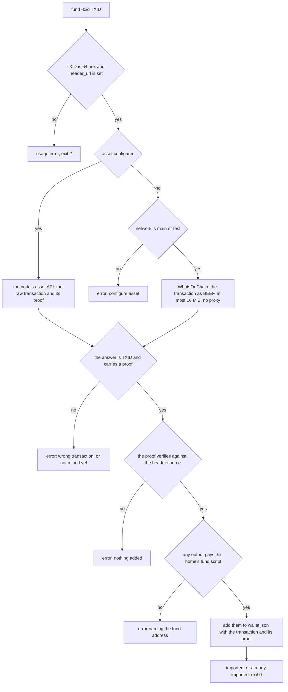

# The owner flow

What `bfinger` does on the publisher's side, in order, and what each step
leaves on disk. The transitions as diagrams are [flows.md](flows.md) 8 to 13;
the reader's side is [committed-record.md](committed-record.md) section 10;
every flag is in [configuration.md](configuration.md).

Reading needs only `header_url`. Publishing also needs a submit endpoint
(`facade`), a settlement leg (`settle`), coin in the wallet, and a node
(`rpc`, `asset`) unless `settle = arcade:` with `proofs = async`, `header_url`
set and `funding` not `wallet`
([flows.md 13](flows.md#13-publishing-through-arcade-with-no-node)). None of
these has a default.

## Files under `~/.bfinger`

The directory is 0700 and every file bfinger writes in it is 0600.

| File | Holds |
| --- | --- |
| `config` | deployment addresses, `key = value` (yours to write) |
| `identity.json` | the identity root key (WIF) |
| `wallet.json` | the spendable outputs that pay fees (a `pool.json` from older versions is renamed on open) |
| `state.json` | what was last published, the witness, every funding tree |
| `known_keys` | the reader's pins |
| `journal/<seq>-<txid>.json` | one entry per transition attempt, written before either leg is sent |
| `successor/identity.json` | the next identity key, between `rotate` and the transition that promotes it |
| `identity-prev-<seq>.json` | a promoted predecessor, kept because the wallet still holds outputs locked to its fund key |
| `payments/<txid>.json` | a payment notice, what a messagebox would carry |

The witness in `state.json` is the one secret that is not a key: with the key
it authorises exactly one next transition, so it is never printed or served.

## Commands

`init` creates the identity; `create`, `status`, `rotate` and `retire` publish
transitions; `kill` sweeps every funding tree; `publish -resume` re-sends the
object leg; `fund`, `pay` and `receive` move coin; `domain-docs` writes the
domain's two documents; `serve-wallet` serves this home's wallet on loopback;
`doctor` reports. Flags are in
[configuration.md](configuration.md#owner-command-flags). Without `-yes` a
sending command builds and prints and sends nothing; with `funding = wallet`
that, and `-dry-run`, are refused, because the wallet broadcasts what it signs.
The wallet is bfinger's own, so no other tool can double-spend it.

## Coin into the wallet

`init` prints the fund address: a mainnet address when `network = main`, a
testnet one for `test` and `regtest`. Coin arrives three ways: `fund -txid`
for a mined payment to that address from any wallet, `receive` for a BRC-29
payment from another bfinger user, and `fund -blocks` for coinbase on a chain
you can mine (spendable after 100 blocks).

Every failure exits 2. The source is never trusted: its answer must be the
transaction asked for and its proof must hold against your own header source
([flows.md 2](flows.md#2-header-source)). No node is needed.

## One transition, step by step

The shapes are [flows.md 6 to 9](flows.md#6-object-shapes); what follows is
the order and what each step leaves behind.

1. **Proofs first.** Collect the proof of anything published before it mined
   (token, trees, journal entries, held change) and publish each proven object
   again so hosts upgrade their copy. Skipped on a dry run.
2. **Funding tree**, when the current one has fewer spare outputs than the
   transition spends (one per carrier, stores included) or is under another
   identity (after a rotation): `-funding-count`
   outputs (default 16) of `-funding-sats` (default 1), plus change. Settled,
   recorded in `state.json` (`funding`, and appended to `trees`), then
   published.
3. **Record, carrier, token.** The carrier spends the next funding output at
   fee zero; its txid is `C`. The token spends the previous token (updates
   only) and one fee input, at one satoshi per byte with a 250 satoshi floor.
4. **Journal entry**, then the settlement leg (`tcp:`, `rpc:` or `arcade:`).
   `proofs = wait` waits for the proof; `async` goes on once the leg reports
   acceptance (with `tcp:`, only when `funding = wallet`).
5. **State**, saved as soon as the token is settled: sequence, token,
   carrier, previous carrier, witness, funding index, body, and, while the
   token is unmined, its BEEF, which the next transition must carry. Saving
   before the object leg means a facade failure cannot leave a state that
   names a token already spent.
6. **Object leg**: any store carriers, the carrier's atomic BEEF (with its
   funding parent's proof, or its ancestry while unmined), then the token's, to
   the facade. A 200 that admits nothing is either already held or refused,
   so bfinger asks the lookup host (`host`, else the manifest's `ls_finger`)
   for the carrier or token: held is `DUPLICATE`, not held is an error. If a
   post fails, `publish -resume` re-sends them from the state.

## Rotation

`rotate -yes` writes `successor/identity.json` (or takes `-successor HEX`;
with `wallet = wire`, the wallet's identity), publishes a rotate record signed
by the current key, and marks the successor pending in `state.json`. The next
transition runs under the successor with a new funding tree; on success
`identity.json` becomes `identity-prev-<seq>.json` and the successor file
takes its place. Then serve the resolve document `rotate` printed; until then
readers refuse with `REFUSED-KEY` ([flows.md 10](flows.md#10-rotation)).

## Payments (BRC-29)

`pay` derives the destination from the recipient's identity key under
`[2, "3241645161d8"]` with a fresh prefix and suffix, settles an ordinary
payment, waits for its proof (from the ARC service when there is no node), and
writes `payments/<txid>.json` (sender key,
prefix, suffix, txid, output, atomic BEEF). Carry it to the recipient by hand
(no messagebox yet). `receive` verifies it against the recipient's own header
source and re-derives the key before adding it
([flows.md 18](flows.md#18-brc-29-pay-and-receive)).

## Signing

No command signs with a private key directly. Field signatures come from
`Derivation.Lock` and input signatures from `Derivation.Unlocker` (both in
`bcommon/pushdrop`) and the wallet's P2PKH unlocker, all through
`wallet.Interface`: the embedded `ProtoWallet`, or a remote wallet
with `wallet = wire`.

## Recovery

- `doctor` names any journal entry whose settlement or object leg failed, and
  what is still waiting for a proof.
- `publish -resume` rebuilds the current state's objects from `state.json` and
  re-POSTs them (after a failed object leg, to a host that lost them, or to
  seed another facade), safely repeatable. It never re-mints or
  re-settles (re-broadcasting a superseded sequence would fork the directory)
  and never reads the journal to decide what to send.
- A `fund -blocks` run that stopped between mining and adding:
  `fund -rescan -blocks N`. Any other payment to the fund address:
  `fund -txid`.
- `kill -confirm KILL -yes`: one mined sweep per tree in `trees`, rotations
  included, every output used or not, published to the topic
  ([flows.md 11](flows.md#11-retire-and-kill)).
