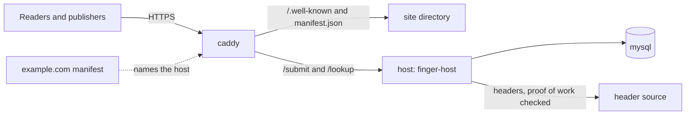
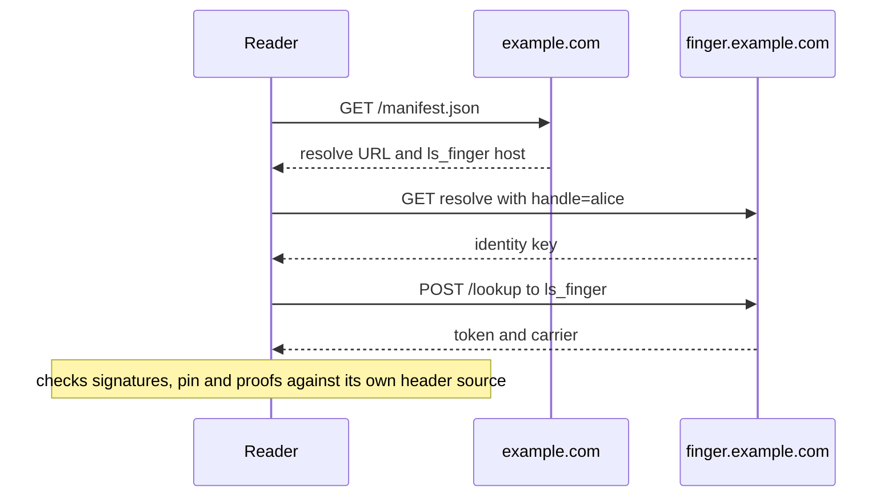

# Running your own

Four steps, each run from a container: read any address, run a host, make your
domain answer for a handle, and publish your own record. None of them needs
the multicast network: a host on its own is a complete deployment, and
readers verify whatever it serves.

Names are illustrative: the domain is `example.com`, the handle `alice`, and
the host `finger.example.com`.



## 1. Read

```console
$ docker run --rm -it -v bfinger:/home/nonroot/.bfinger \
    ghcr.io/lightwebinc/bfinger -header-url woc:main alice@example.com -ansi
```

The volume keeps the pin store, so a second lookup checks the key against the
one you accepted the first time. `woc:main` is the public WhatsOnChain API;
every header it answers is checked for proof of work (see
[configuration.md](configuration.md#header-sources)). The image is
`linux/amd64` and `linux/arm64`; release tarballs carry the binary for macOS
and Linux.

## 2. Run a host

On AWS, one CloudFormation stack builds the server and starts all of this:
[deploy/aws](../deploy/aws/README.md). Anywhere else, on a server with
Docker, ports 80 and 443 free, and a DNS name pointing at it:

```console
$ curl -fsSLO https://github.com/lightwebinc/bfinger/releases/latest/download/compose.yaml
$ mkdir site
$ HOST=finger.example.com docker compose up -d
```

Create `site` first: a bind-mount directory that does not exist is created
owned by root, and step 3 could not write into it. Every later `docker
compose` command (`logs`, `exec`, `down`) needs `HOST` too: `export` it, or
put `HOST=finger.example.com` in a `.env` file beside `compose.yaml`.

| Service | What it is |
| --- | --- |
| `host` | `ghcr.io/lightwebinc/finger-host`: the reference overlay host with `tm_finger` and `ls_finger` built in. It admits records, answers lookups, and checks every proof against its header source |
| `db` | MySQL, the host's storage, reachable only inside the project's network |
| `caddy` | TLS for `HOST` (certificate fetched on first start), the handle resolve endpoint, `manifest.json`, and CORS so a web page can read the host. `/admin/*` and `/metrics` answer 404 from outside |

Settings, all optional except `HOST`:

| Variable | Default | |
| --- | --- | --- |
| `HOST` | none | this server's DNS name; several, comma-separated, are allowed |
| `HEADERS` | `woc:main` | the host's header source; `chaintracks:https://headers.example.com/v2` for one you run |
| `NETWORK` | the source's own | `main`, `test` or `regtest` |
| `ADMIN_TOKEN` | random per start | bearer token for `/admin` |
| `SYNC_PEERS` | none | hosts to catch up from, `tm_finger=https://other-host.example.net` |
| `DB_PASSWORD` | a fixed internal value | the database is reachable only from the host container |
| `FINGER_HOST_IMAGE` | this release's `finger-host` (`latest` in the repository copy) | the image to run |

### Catching up from another host

A new host fills itself from an existing one with GASP. Name the peer in
`SYNC_PEERS`, set `ADMIN_TOKEN`, and trigger the sync from inside the
project (the host image has no curl):

```console
$ export HOST=finger.example.com ADMIN_TOKEN=change-me \
    SYNC_PEERS=tm_finger=https://other-host.example.net
$ docker compose up -d
$ docker compose exec host node -e 'fetch("http://localhost:8080/admin/startGASPSync",
    {method:"POST",headers:{authorization:"Bearer "+process.env.OVERLAY_ADMIN_TOKEN}})
    .then(async r=>console.log(r.status,await r.text()))'
200 {"status":"ok","topicsWithPeers":1,"peerFailures":0}
```

`"no-peers"` means `OVERLAY_SYNC_PEERS` did not reach the host. The peer sends
the current state of every identity, not its history; the host rebuilds each
chain from what it received without a restart (see
[host/README.md](../host/README.md#restore-and-catch-up)).

## 3. Make your domain answer

```console
$ docker run --rm --user "$(id -u):$(id -g)" -v "$PWD:/w" -w /w \
    ghcr.io/lightwebinc/bfinger domain-docs alice@example.com \
    -host https://finger.example.com -key 02abab…abab -out site
```

Run it beside `compose.yaml`. `-key` is the identity key `bfinger init`
printed (step 4; run `init` first if you have no identity yet). Without
`-key` the home's identity is used, but this container has no home mounted.
The command contacts nothing and writes two files into `site/`:

- `manifest.json`: serve it at `https://example.com/manifest.json`, from that
  host itself (a redirect to another host is not followed). It names
  `https://finger.example.com` for `ls_finger` and `tm_finger`, and the
  resolve endpoint under it.
- `.well-known/metanet-handles/by-handle/alice.json`: the resolve answer,
  which the stack serves from `./site`. If `example.com` itself points at the
  server, the stack serves `manifest.json` too: set
  `HOST="example.com, finger.example.com"`.

Run it once per handle into the same directory; the manifest keeps its other
fields and handles.



Check from anywhere:

```console
$ bfinger -header-url woc:main alice@example.com -v
```

## 4. Publish

With your own host as the facade, publishing needs no node: transactions go to
the public arcade and proofs are read from WhatsOnChain unless you name your
own (`settle`, `chain`). Put the settings in `bfinger.env` (in a config file they are the same
keys in lower case without `BFINGER_`, see
[configuration.md](configuration.md#keys)):

```
BFINGER_HEADER_URL=woc:main
BFINGER_FACADE=https://finger.example.com
BFINGER_PROOFS=async
```

`FACADE` is the host's base URL (bfinger posts to its `/submit`).
`BFINGER_SETTLE=arcade:https://arcade.example.com` names your own arcade, or
`arc:<url>` an ARC installation (`BFINGER_ARCADE_KEY` holds a bearer token if
it wants one). `PROOFS=async` returns once the network accepts a transaction and
collects the proof later, which is what a ten-minute block needs.

```console
$ alias bfinger='docker run --rm -it -v bfinger:/home/nonroot/.bfinger --env-file bfinger.env ghcr.io/lightwebinc/bfinger'
$ bfinger init
$ bfinger fund -txid 1111111111111111111111111111111111111111111111111111111111111111
$ bfinger create alice@example.com -set status=available -yes
```

`init` prints the identity key and the fund address. Pay the fund address
from any wallet; once that transaction is mined, `fund -txid` imports its
outputs to the fund address after checking its proof against the header
source. A wallet that hands over the payment as BEEF needs no wait:
`fund -beef -` reads it on standard input (run the container with `-i` and
without `-t`). The [user guide](user-guide.md#8-publishing-your-own) covers `status`,
`rotate` and the rest.
