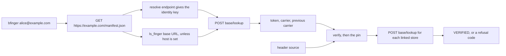
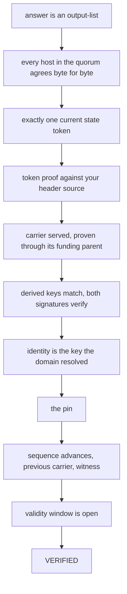
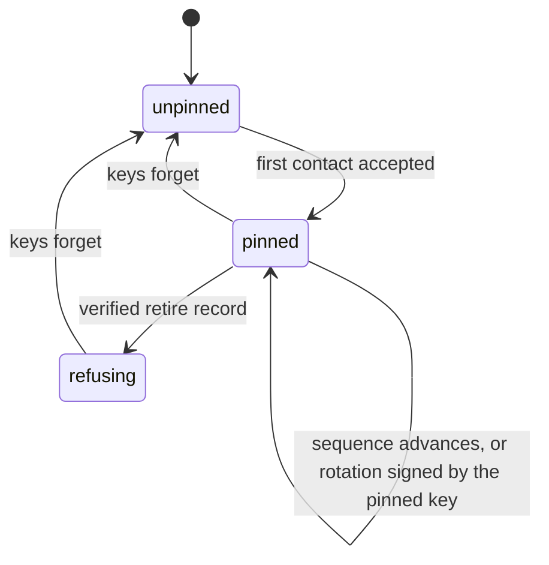
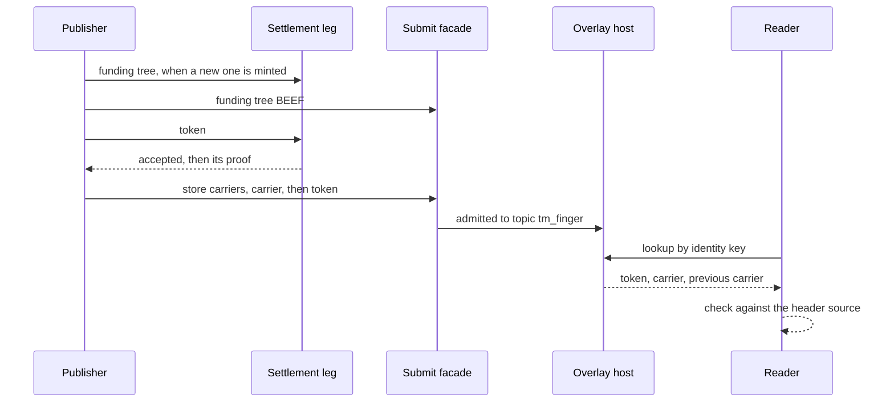
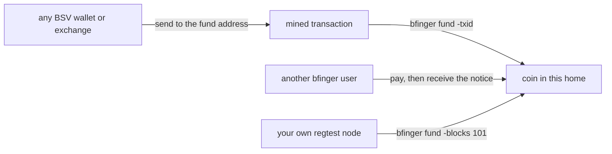

# bfinger user guide

How to read addresses and publish your own. New here? Start with
[QUICKSTART.md](../QUICKSTART.md). Hosts and domains are in
[docs/self-host.md](self-host.md), every setting and default in
[docs/configuration.md](configuration.md), a worked run of every command in
[docs/examples.md](examples.md), and the normative reference in
[docs/committed-record.md](committed-record.md). Every key, txid, address and
hostname below is illustrative.

## 1. What this is

`bfinger alice@example.com` answers one question: what does that address
currently claim about itself? The claim is a small record its owner published:
a status line, a plan, whatever fields they chose. HTTPS proves you reached
the right server, not that it told the truth. Here the host hands over the
record with a Bitcoin proof, and your copy of the tool checks it: the proof
against block headers *you* fetched, the signatures, and the identity key
against the one you saw last time. A lying host gets a refusal, never a wrong
answer. Sections 2 to 7 cover reading, 8 to 10 publishing, with one binary.

## 2. Install

- **Release tarball**: `bfinger_<version>_<os>_<arch>.tar.gz` for
  `linux/amd64`, `linux/arm64`, `darwin/amd64`, `darwin/arm64`, with
  `SHA256SUMS`. The licence files travel inside the tarball.
- **Container image**: `ghcr.io/lightwebinc/bfinger:<tag>`, distroless,
  `nonroot`, `linux/amd64` and `linux/arm64`.
- **From source**: `go build ./cmd/bfinger`. The only direct dependencies are
  go-sdk and `github.com/lightwebinc/bcommon`, both pinned.

`bfinger -version` prints the stamped version and answers even when the config
file is malformed; the `version` subcommand does not.

### Running in a container

The entrypoint is the binary. Mount a named volume at
`/home/nonroot/.bfinger`: it holds the pin store and, for a publisher, the
identity. Keep credentials in an env file, not on the command line:

```console
$ cat bfinger.env
BFINGER_HEADER_URL=woc:main
BFINGER_FACADE=https://finger.example.com
BFINGER_SETTLE=arcade:https://arc.example.com/v1
BFINGER_PROOFS=async
BFINGER_ARCADE_KEY=change-me
$ alias bfinger='docker run --rm -i -t --env-file bfinger.env \
    -v bfinger-state:/home/nonroot/.bfinger ghcr.io/lightwebinc/bfinger:<tag>'
$ bfinger alice@example.com
```

`-i -t` gives the first-contact prompt a terminal; in a script drop them and
pass `-yes`. Bind mounts, addresses seen from inside the container and
`wallet = wire`: [configuration.md](configuration.md#in-a-container).

## 3. Configuration

### The header source

`header_url` (`-header-url`) is where this reader gets the block headers it
checks proofs against. There is no default: headers from whoever answered the
lookup would verify nothing, and a built-in default would send every
verification question to a party nobody chose. Without one a lookup stops at
exit 2, before any network call:

```console
$ bfinger alice@example.com
bfinger: no -header-url configured; VERIFIED needs a header source and there is no default (for mainnet: -header-url woc:main)
```

Sources are `woc:main` or `woc:test` (public WhatsOnChain),
`chaintracks:https://host/v2`, or a bridge's `/v1` URL; headers from the first
two are proof-of-work checked, so lying about a root costs a mined block.
`network` (`main` by default, `test`, `regtest`) must match a `woc:` source.
The table and the checks: [configuration.md](configuration.md#header-sources).

### The config file and precedence

One `key = value` per line, `#` for a comment line, nothing else. It is found
at `-config`, else `$BFINGER_HOME/config`, else
`$XDG_CONFIG_HOME/bfinger/config`, else `~/.bfinger/config`. Flags beat the
environment (`BFINGER_` plus the uppercased key), which beats the file, which
beats the default. The twenty keys are in
[configuration.md](configuration.md#keys). What trips people up:

- **A misspelt key is fatal** (exit 2) for every command except `-version`,
  `-h` and `help`:
  `bfinger: /home/alice/.bfinger/config: config: unknown key: line 1: "hots"`.
- **Empty values.** An empty environment variable or flag is unset. An empty
  value in the file is applied: `timeout =` and `quorum =` exit 2, and
  `home =` moves the home to the working directory.
- **`-home` does not move the config file**, and overrides a `known_keys`
  line; `quorum = 0` exits 2 while `-quorum 0` is ignored. Details:
  [configuration.md](configuration.md#the-config-file).

`bfinger doctor` shows what all this resolved to: identity, wallet, publishing
state, pin store, header source, node (when `asset` is set), facade and
settlement leg (when `facade` is set), and journal. It contacts the header
source, the node, an `arcade:` leg and a wire wallet, and exits 0 whatever it
finds, so never branch a script on it.

## 4. Your first lookup

`bfinger -header-url woc:main alice@example.com` runs the chain below.

**Where flags go.** Global flags (`-config`, `-home`, `-host`, `-header-url`,
`-known-keys`, `-quorum`, `-timeout`, `-json`, `-v`, `-version`) go before the
address or command word. Reader flags work on either side of the address, for
a lookup and for `verify`: `bfinger -l alice@example.com` equals
`bfinger alice@example.com -l`. So do the flags of `create`, `status`,
`rotate`, `pay`, `domain-docs`, `keys trust` and `keys forget`. `keys trust`
and `keys forget` reject `-json` and `-v`; `keys list` and `keys verify`
ignore anything after them.



A run contacts the domain's manifest, the resolve endpoint it names (or
`https://<domain>/.well-known/metanet-handles/resolve`), the overlay host, the
header source, and DNS. Nothing else.

### First contact

With no pin yet, the tool shows what it would write, on standard error:

```
first contact with alice@example.com
  identity key 02abababababababababababababababababababababababababababababababab
  fingerprint  SHA256:kVNODzs2PyEhJazOPW/nmZaSMToyMRIs3xbY5okYKHQ
  answered by  192.0.2.10:443, sequence 7, mined=true
Trust this key? [y/N]
```

`y` or `yes`, in any case, accepts; anything else writes nothing and exits 1
with `REFUSED-KEY`. Accepting without the fingerprint from elsewhere trusts
the first answer, like SSH; with it, compare, or use `keys trust` (section 6).
In a script pass `-yes`: a stdin that is not a terminal declines with
`not a terminal and no -yes given: refusing to pin on first contact`, and
`< /dev/null` prompts, reads end-of-file and declines. Both exit 1.

### The result

```
alice@example.com
  VERIFIED   signature, sequence 7 (update), proof at height 912430
  key        02abab…abab  (pinned 2026-04-11)
  plan       shipping 2.0
  status     available
```

- The address is normalised: lowercased, `acct:` or a leading `@` stripped, a
  `+tag` removed, so `alice+work@` and `alice+home@` share one pin.
- `VERIFIED` is the outcome token (section 5). `sequence 7 (update)` is the
  record's sequence and kind (`create`, `update`, `rotate`, `retire`).
  `proof at height N` means your header source confirmed the proof; the
  alternative is `unmined`.
- `(pinned <date>)` is when the pin was first recorded. A new pin reads
  `(pinned <date> (first contact))`, a rotation `(rotated today)`, and a run
  that wrote no pin (a refusal, or a verified `retire`)
  `(pinned <first date>, unchanged)`.
- A rotation record adds `successor rotated to <key>`. Then come the body
  fields, sorted, and each linked store's content under its name, or
  `<name> <CODE> <reason>` for a store that did not verify.

Control characters and escape sequences from a record never reach your
terminal (except colour under `-ansi`), and each value is bounded at 200 lines
and 512 columns, a cut value ending in `[truncated]`.

`-l` adds the full key, `fp`, `token`, `carrier`, `previous`, `window` (a zero
bound reads `unbounded`; the line is dropped when both are zero), a
`store <name> carrier <txid>` or `store <name> manifest <txid>, N member(s)`
line per store, a `ref` line per reference, and `host` with every host that
agreed.

### Other shapes of the same answer

- **`-json`**: one object with a stable schema; it wins over `-field`. `mined`
  and `window` are always present, `stores[]` carries each store's `code` and
  full, unbounded `body`, and `steps[]` uses capitalised names
  (`.steps[].Name`). Every field: [examples.md](examples.md).
- **`-field plan`**: one body field, or the store of that name, bounded like
  the plain rendering. It prints only when the record verified; a refused
  record prints nothing and exits 1. A store that did not verify prints
  `<CODE> <reason>` in place of its content, with exit 0 because the record
  verified: check the first word, or use `-json`. Under `verify` an unmined
  answer prints the value and exits 1.
- **`-ansi`**: lets a record's SGR colour through, re-checked rather than
  copied, and every coloured value ends with a reset. `NO_COLOR` and `TERM`
  are not consulted: bfinger adds no colour of its own. `-json` escapes
  everything.
- **`-ascii`**: record values print characters above 7 bits as `?`. It is the
  default when the first of `LC_ALL`, `LC_CTYPE`, `LANG` that is set names no
  UTF-8 encoding; with none set the locale counts as UTF-8.
- **`-v`**: the trace and per-check verdicts on standard error (`verify`
  always prints them).
- **`-watch`**: polls every `-interval` (15s) and prints each change after a
  UTC timestamp. Every poll is a full verification and pin check; a failed
  poll prints `watch: <error>` and polling continues. `-once` exits after the
  first *change*, with that answer's exit status as a single lookup would
  give it; an interrupt exits 0 whatever was seen. `verify` ignores `-watch`.

## 5. What VERIFIED actually means



A non-`output-list` answer exits 2: it made no claim that could be false.
Signatures are checked *before* the pin, so the reader never decides who
should have signed and then looks for a match. The pin catches the host
itself; sequence and witness catch a record inserted by someone holding the
key but not the state. The window allows two minutes of clock skew.

Linked stores are checked only after the record verifies, each with its own
code; a failed store does not fail the record. `VERIFIED-UNMINED` is every
check passing before the token has a proof. It is normally seen only from
publishers using `proofs = async`, and lasts until they re-publish with the
proof (section 8), which can be well after the block.

### The refusal vocabulary

| Code | What it means | What to do |
| --- | --- | --- |
| `VERIFIED` | Every check passed against a mined proof. | Nothing. |
| `VERIFIED-UNMINED` | Every check passed; no proof yet. | Wait, or ask the owner to run `publish -resume`. Exits 1 under `verify`. |
| `RECORD-PENDING` | The token verified; the carrier it commits to has not reached this host. | Wait, or ask another host. |
| `NO-TOKEN` | Nothing for this identity, or only carriers. For a store: no such carrier, or committed to but not linked. | Correct for a killed identity. Otherwise check the key and host. |
| `REFUSED-DECODE` | Something did not parse, an output is neither token nor carrier, or a token's input script or ancestry fails. | Suspect the host or a version skew. |
| `REFUSED-KEY-DERIVE` | A locking key is not derived from the record's identity. | Do not trust it. |
| `REFUSED-SIG` | A signature fails, or a carrier input does not satisfy its funding output. | Do not trust it. Tell the host operator. |
| `REFUSED-KEY` | The key is not the one the domain resolved; or not the pinned one with no followable rotation; or the previous record names another identity; or first contact was declined (no terminal and no `-yes` included). | Check out of band. After a rotation the domain must name the new key. |
| `REFUSED-SEQ` | The sequence rolled back below the pin, or skipped. | Do not trust it. |
| `REFUSED-FORK` | Two current tokens, or the quorum's hosts disagreed. | Alert the operator. |
| `REFUSED-EXPIRED` | The validity window is not open. | Ask the owner to republish. |
| `REFUSED-BUMP` | A proof is not in your header source. | Usually your source is behind. Check `doctor`. |
| `REFUSED-COMMIT` | The previous carrier was not served. For a store: the answered carrier, manifest or a member's size does not match the commitment. | Record: ask another host. Store: do not trust it. |
| `REFUSED-WITNESS` | The witness does not hash to the previous commitment. | Do not trust it. |
| `REFUSED-MINEABLE` | The carrier could reach the chain. | Do not trust it. |
| `REFUSED-RETIRED` | Your pin store says this address was retired. | Correct. |
| `UNSUPPORTED` | A store only: a feature this build lacks. The record verified. | Upgrade the reader. |
| `ERROR` | A store only: its fetch failed, the header source did not answer for it, or it exceeds the run's 16 MiB fetch budget. | Try again later. |

When the reader cannot decide about the record itself, typically because the
header source did not answer, the run is a transport failure (exit 2), never a
printed `ERROR`.

### Exit codes

| Code | Meaning |
| --- | --- |
| 0 | The record verified, or the command did what it was asked. |
| 1 | Refused or not found; the printed token says which. |
| 2 | Usage error, configuration error, or transport failure. |

A refusal exits 1 and a transport failure 2, so a script can tell a forgery
from an outage; `keys verify` is the exception, exiting 1 on any drift, an
unreachable address included. The status is the record's verdict: a verified
record exits 0 even when a store did not verify, so check `stores[].code` when
stores matter. A refusal prints nothing to standard error unless `-v` is given
or the command is `verify`.

`-accept-unmined` is true for a lookup and false for `verify`, so a fresh
unmined answer exits 0 under one and 1 under the other. To make a lookup
strict, write `-accept-unmined=false`, with the equals sign.

## 6. Key pinning

The pin asks whether the key an answer is signed by is the key this reader saw
last time.



A key change without a followable rotation is a refusal that writes nothing:
the store is only written after a pass. Unmined answers never advance the
pinned sequence.

- **Rotation.** The owner publishes a `rotate` record, signed by the current
  key, naming the successor. A reader that verifies the successor's first
  record re-pins, and the old key becomes an `@rotated-from` line. A reader
  follows a rotation only while it is the record immediately before the
  current one; one that first looks after a further transition refuses with
  `REFUSED-KEY` and must re-pin out of band (`keys trust -force`).
- **A rotation signed by the new key is not a rotation**: it is the claim
  under question. An `@rotated-from` line never satisfies a pin.
- **Retired is terminal**: every later answer that reaches the pin check is
  `REFUSED-RETIRED`. After a `kill` the host answers nothing (`NO-TOKEN`).

- **`keys list`** prints the store, one line per pin.
- **`keys trust alice@example.com -key <hex> [-fingerprint SHA256:...]`** pins
  a key you already have, with no network round trip. `-fingerprint` makes it
  refuse (exit 1) unless the key matches, which turns a fingerprint read to
  you over the phone into a checked pin. An existing or retired pin needs
  `-force`.
- **`keys forget alice@example.com [-all]`** removes the pin in force and
  keeps the rotation history, which explains a later first contact; `-all`
  removes that too.
- **`keys verify`** re-reads every active pin and writes nothing. A rotation
  reports `ROTATED to 03ababababab (run a lookup to re-pin)`. Any rotation,
  retirement, refusal or unreachable address exits 1; an advance in sequence
  does not. It runs the whole reader chain per pin, so it contacts many
  domains.

The store is `~/.bfinger/known_keys`, 0600 in a 0700 directory:

```
alice@example.com secp256k1 02ab…ab seq=7 first=2026-04-11T09:02:11Z last=2026-09-24T18:40:03Z fp=SHA256:kVNODzs2PyEhJazOPW/nmZaSMToyMRIs3xbY5okYKHQ
@rotated-from bob@example.com secp256k1 03ab…ab until_seq=4 at=2026-08-02T11:15:00Z
@retired carol@example.com secp256k1 02ab…ab at=2026-09-01T00:00:00Z fp=SHA256:kVNODzs2PyEhJazOPW/nmZaSMToyMRIs3xbY5okYKHQ
```

(keys shortened here; the file holds all 66 hex characters). The grammar is
described in [docs/known-keys.md](known-keys.md) and implemented by bcommon's
`knownkeys` package. The store fails closed: a malformed line, an unknown
field, a bad key or two active pins for one address makes **every** command
that loads it exit 2, naming the line
(`known_keys line 3: alice@example.com already has an active pin at line 2; ...`),
because skipping it would quietly return that address to first-contact trust.
A group- or world-writable file is refused for the same reason.

## 7. Asking more than one host

Every overlay host is a replica, so asking two is about *seeing a
disagreement*, not getting a better answer. `-quorum N` asks until N of the
addresses the host's name resolves to have answered, and requires the answers
to agree byte for byte; a difference is `REFUSED-FORK`, exit 1, never a
majority pick. Too few addresses stops the run:
`quorum 2 exceeds the 1 host(s) the name resolves to`. A host a few seconds
behind answers fewer outputs, so differing counts are asked again up to four
times, three seconds apart; equal counts with different bytes are a fork at
once. The worst case adds twelve seconds plus four more rounds of requests,
each bounded by `-timeout`.

The replica set lives in DNS ([docs/host-selection.md](host-selection.md)). An
identity can also be read by key, with no domain, and `-host` (or `host` in
the config) is then required:
`bfinger -host https://finger.example.com 02abab…abab`.

## 8. Publishing your own

**Standing warning.** `create`, `status`, `rotate`, `retire`, `kill` and `pay`
spend real funds. None sends anything without `-yes`: the transition is built,
`no -yes given: building only, sending nothing` is printed, and it is
discarded. Under `funding = wallet` a missing `-yes`, or `-dry-run`, is
refused instead (exit 2), because a wallet broadcasts what it signs. `init`, `fund -txid`, `doctor`,
`receive`, `publish -resume`, `serve-wallet` and `domain-docs` spend nothing.
`fund` without `-txid` mines on your own node at once.

**What publishing needs**, beyond `header_url`: `facade` (an overlay submit
endpoint; a host's own `/submit` works) and `settle`: `arcade:<url>` for any
ARC service, `rpc:<url>` for a node that acknowledges, or `tcp:<host:port>`
for bare-EF ingress. A node (`rpc` and `asset`) is needed too, except with
`settle = arcade:`, `proofs = async` and `funding = home`, where the tip comes
from the header source and proofs from the ARC service. That node-free setup is the one
[QUICKSTART.md](../QUICKSTART.md) uses.



The carrier goes only to the facade: it must never be mined.

### Getting started

```console
$ bfinger init
created /home/alice/.bfinger
identity key 02abababababababababababababababababababababababababababababababab
fingerprint  SHA256:kVNODzs2PyEhJazOPW/nmZaSMToyMRIs3xbY5okYKHQ
fund address <base58 address>
```

`init` never overwrites an identity; run again, it prints the existing one.
Files are 0600, a directory it creates 0700. Back the home up before
publishing: `identity.json` is the identity, `wallet.json` the coin, and
`state.json` holds the witness, the one secret that is not a key. Under
`wallet = wire` the key is the wallet's, there is no `identity.json`, and
`init` prints `created <home> for the wire wallet at <url>`. File layout:
[docs/owner-flow.md](owner-flow.md).

### Putting coin in the wallet



**From any wallet.** Send BSV to the fund address `init` printed and, once it
is mined, import it:

```console
$ bfinger fund -txid 1111111111111111111111111111111111111111111111111111111111111111
imported 1 output(s), 10000 sat, mined at height 912430; wallet 1 output(s), 10000 sat
```

This imports the transaction's outputs that pay the fund address, after
verifying its proof against your header source. The transaction comes from
your node's asset API when `asset` is set, else from WhatsOnChain (`main` and
`test` only). An unmined transaction is refused (`not mined yet`), a repeat
says `already imported`, and one paying nothing to this home is refused.

No wallet yet? BRC-100 wallets such as BSV Desktop or BSV Browser can send to
the fund address. They do not connect to bfinger: `wallet = wire` needs a
wallet serving the BRC-100 wallet wire on loopback, which today means
`bfinger serve-wallet` or [tools/walletd](../tools/walletd/README.md).

**Somebody pays you**: `bfinger pay <your identity key> 50000` on their side,
`bfinger receive notice.json` on yours (section 10).

**You mine it**, on a chain you control: `bfinger fund -blocks 101` calls
`generatetoaddress` on your node (coinbase matures after 100 blocks), and
`fund -rescan -blocks N` recovers coinbase a run mined but did not record.

**Whose coin pays.** With `funding = home` (the default) fees come from
`wallet.json`, coin that is bfinger's own and that nothing else spends;
`wallet = wire` alone changes who signs, not where the coin is. With
`wallet = wire` and `funding = wallet`, the wire wallet funds, signs and
broadcasts every mined transaction (funding tree, tokens, payments, the kill
sweep) from its own coin, so `fund` is not needed; bfinger still builds the
carrier and signs the inputs only it can. That needs a wallet implementing the
action flow, such as `tools/walletd` (`serve-wallet` does not), and that
wallet's coin is shared with whatever else uses it. A carrier's spend of its
funding output never reaches the chain, so bfinger tells the wallet which
outputs it used, and refuses a transition (exit 1) when an output it would
spend is gone from the wallet's basket, or the basket is empty: a second
carrier on one output retracts every record that tree funded. Trees funded
under `funding = home` are not checked, `kill` never consults the basket, and
`doctor` compares the two views on its `funding` and `basket` lines.

### Create and update

```console
$ bfinger create alice@example.com -set status=available -set plan="shipping 2.0" -yes
$ bfinger status "back soon" -yes
$ bfinger status -set plan="shipping 2.1" -unset status -yes
```

`create` publishes sequence 1 and refuses (exit 1) if a state exists. `status`
publishes an update; a bare positional is `-set status=<text>`, and an address
there is refused rather than published as your status. `-expires 720h` bounds
the window for that record only; the lower bound is always the build time.
Every transition ends with a result block on standard output:
`alice@example.com seq 12 update`, then its `token` and `carrier`.

Owner commands act on the identity in the home (`~/.bfinger` unless `-home`,
`BFINGER_HOME` or `home =` says otherwise). Only `create` (your address),
`pay` (the payee) and `domain-docs` (the handle) take an address. A second
identity is a second home, for example a config naming
`home = /home/alice/.bfinger-work` passed with `-config`.

### Not waiting for a block

By default a transition returns once its token is mined. To return in seconds:

```
settle = arcade:https://arc.example.com/v1
proofs = async
```

The ARC service checks policy and reports acceptance; a refusal stops the
transition before anything is published. `arcade_key` is sent as a bearer
token. The result block then reads `token <txid> (accepted, proof pending)`,
and readers see `VERIFIED-UNMINED` (a lookup exits 0, `verify` 1). The proof
is collected by your next transition sent with `-yes`, or by
`bfinger publish -resume`; other commands do not collect it. Collecting
re-publishes the proven token, each host checks it against its own headers,
and readers then see `VERIFIED`. `doctor` lists anything waiting.

Updates can follow each other faster than blocks, each spending the unmined
one before it. Change from other unproven transactions is held until it mines;
if nothing is left to spend, the command says so and sends nothing.
`proofs = async` with `settle = tcp:` is refused unless `funding = wallet`,
because bare ingress acknowledges nothing.

### Writing a plan

In `bfinger status -set plan=@plan.txt -yes`, `-set k=@file` reads a value
from a file, trailing newlines trimmed. The command prints
`body N of 16384 bytes` and refuses over the bound. A value may hold printable
text, newlines, tabs, emoji and ANSI SGR colour; any other escape sequence,
control or zero-width or bidirectional character, more than 200 lines or a
line over 512 columns is refused by line number. Readers show colour only with
`-ansi`, so write for plain text first; half-block art on a coloured
background keeps its shape as a silhouette without colour.

**Stores.** `bfinger status -store plan=@plan.txt -unset plan -yes` publishes
the value in a carrier of its own that the record commits to, so the record
stays small (one trailing newline is trimmed). A reader fetches each store
after the record verifies and prints it where a body field of that name would
be; `-field` finds it too. Stores carry forward until `-unstore name`;
`-store` again replaces one. Content past the 64 KiB sub-record bound is
split, on character boundaries, into parts plus a manifest. Each carrier
spends one funding output, so a two-part store needs four with the record's
own; a larger funding tree is minted when needed (`-funding-count N`, default
16). Store content is not held to the 200-line display bound, so get a
document back through `-json`:
`bfinger alice@example.com -json | jq -r '.stores[] | select(.name=="doc") | .body.doc'`.

`UNSUPPORTED` on a store means the reader lacks a store feature; a reader too
old for stores refuses the record with
`REFUSED-DECODE ... field has the wrong shape: ref`. Both are cured by
upgrading the reader.

### When something did not land

`doctor` lists the journal, one line per transition, including `EF FAILED` and
`PUBLISH FAILED`. `bfinger publish -resume [-facade URL]` re-sends the current
state's objects. It collects waiting proofs, then rebuilds the store carriers
(parts before their manifest), the carrier and the token from the state file
and posts them. It never re-mints and never broadcasts through the settlement
leg, since a superseded sequence re-broadcast would fork the directory. A host
answers `DUPLICATE` for what it holds, so it is safe to repeat, and `-facade`
seeds a second facade. The state file records a transition as soon as its
token is settled, so when the object leg fails (`PUBLISH FAILED`),
`-resume` is the fix. A `create` whose funding tree was settled but whose
record was not continues from that tree when run again.

### Rotating your key

A rotation is **two transitions** plus a domain edit. `bfinger rotate -yes`
publishes a `rotate` record, signed by the current key, naming a new
successor, and prints the resolve answer to publish for it. The next
transition signs under the successor and promotes it. Then update the resolve
document: until it names the new key, readers refuse with `REFUSED-KEY`, and
pinned readers can follow the rotation only while it is the record before the
current one (section 6). A second `rotate` while one is pending is refused,
and a leftover successor file from an aborted rotation must be removed by
hand; the error says so.

`rotate -successor <key>` hands over to a key this home can already sign with,
such as a wire wallet's: with `wallet = wire` in a home still publishing under
its key file, the wallet's identity is the default. The old key file is kept
as `identity-prev-<seq>.json`, because coin is locked to its fund key.

### Retiring and killing

`bfinger retire -confirm RETIRE -yes` publishes kind 4 with an empty body;
`status` and `rotate` then refuse. Hosts keep serving it, which is how readers
learn the address was retired rather than absent.

`bfinger kill -confirm KILL -yes` is **irreversible**. It settles one sweep
per funding tree, spending every output, waits for each to be mined and
publishes it. Every carrier those trees funded becomes a double spend, hosts
drop the records, and readers get `NO-TOKEN`. Without `-yes` (under
`funding = home`) it prints each sweep and sends nothing. Mechanics and
recovery: [docs/owner-flow.md](owner-flow.md).

## 9. Being findable

For `alice@example.com` to resolve, `example.com` serves a manifest and a
resolve answer.
`bfinger domain-docs alice@example.com -host https://finger.example.com [-key HEX] [-out DIR]`
contacts nothing and writes `manifest.json` and
`.well-known/metanet-handles/by-handle/alice.json` into `DIR` (default
`bfinger-site`); run it once per handle into the same directory. `-key`
defaults to this home's identity (the wallet's under `wallet = wire`). Serving
them: [docs/self-host.md](self-host.md). You do not need the domain to
publish; without it, readers use your key and `-host`. What a reader checks:

- **The manifest** is `https://example.com/manifest.json`, https only, no
  fallback. `metanet.overlays.ls_finger` is the host base URL (the reader
  appends `/lookup`); without it and without `-host` a lookup stops with
  `example.com does not name ls_finger in its manifest and no -host is configured`.
  `metanet.handles` must be present with a `version` of major 1; its `resolve`
  URL is optional (absent, the well-known path is used) and must be https.
- **The resolve answer** to `GET <resolve URL>?handle=alice` (bare handle, no
  `+tag`) is
  `{"metanetHandles":"1.0","handle":"alice","domain":"example.com","identityKey":"02abab…abab","ttl":3600,"revoked":false}`.
- **The echo check**: `handle` and `domain` must equal what was asked, which
  catches a static file answering every handle:
  `endpoint echoed "bob" at "example.com", not the handle asked for`.
- `identityKey` is 66 hex characters beginning `02` or `03`; `metanetHandles`
  must have major version 1; `revoked: true` or HTTP 410 is a revocation and
  HTTP 404 means not registered; `ttl` is not acted on; a `certificate` is
  kept and not verified (section 12).

## 10. Payments

An identity key is a payment root, so any directory entry is payable:
`bfinger pay alice@example.com 1000 -yes` (an address or identity key, then a
positive amount in satoshis) derives a BRC-29 destination from the recipient's
key with a fresh prefix and suffix, pays it, waits for it to be mined (asking
the ARC service when there is no node), and writes a **notice** to
`~/.bfinger/payments/<txid>.json`: sender key, derivation, txid, output, and
the BEEF with its proof. It resolves the recipient before reading your node
settings, so a bad address fails as a resolution error. Deliver the notice by
any means.

The notice is written as soon as the payment is sent, and rewritten with the
proof once it mines. The wait is bounded (ten minutes from a node, an hour
from an ARC service, since public blocks can be slow); if it runs out, `pay`
still succeeds and reports `sent, proof pending`, the notice stays valid
(`receive` fetches the proof by txid once the payment has a block), and the
change is held until a later command collects its proof.

`kill` records each sweep in the state as soon as it is sent and posts it to
the hosts before waiting for its block, so a slow block never leaves records
standing. If posting fails, run `kill` again: it re-posts the recorded sweep
rather than building a second one.

`bfinger receive notice.json` adds it to the recipient's coin, and refuses
unless the notice is addressed to this identity, its BEEF matches its txid and
output, its proof is in *your* header source, and the output is locked to the
key derived from the sender. A repeat prints `already held`; keep notice
files, they recover a payment a crash dropped. With `funding = wallet`, `pay`
is funded by the wallet and `receive` hands the payment to the wallet
(`internalized by the wallet`).

## 11. Troubleshooting

| What you see | Meaning, exit | Fix |
| --- | --- | --- |
| `header source woc:test is the test network but network is main; ...` | 2. | Match `network` to the source. |
| `header fails its proof of work` | The source lied, or serves another chain, 2. | Check `network`; use another source. |
| `flag provided but not defined: -x` | A global flag after the address, or a reader flag before a command word other than `verify`, 2. | Global flags go first. |
| `known_keys line N: ...` / `...group or world writable` | Bad pin store, 2 for every command. | Fix the named line, or `chmod 600`. |
| `REFUSED-KEY ... names a different identity than the domain resolved` | Usually a rotation without the domain edit, 1. | Update the resolve answer. |
| `REFUSED-KEY ... no rotation signed by the pinned key names it` | Key changed without a rotation you can follow, 1. | Check out of band; `keys trust -force`. |
| `manifest for example.com: ... status 404` | No `/manifest.json`, 2. | Publish one; the path is fixed. |
| `rpc and asset must be configured for owner commands` | No node and not the node-free setup, 2. | Set `rpc` and `asset`, or `settle = arcade:` with `proofs = async`. |
| `... pays nothing to this home's fund address ...` | `fund -txid` on the wrong transaction, 2. | Check the txid and fund address. |
| `the topic manager admitted nothing` | The facade took the POST, the host admitted nothing, 2. | Check the host's logs. |

## 12. Where to go next

More: [docs/owner-flow.md](owner-flow.md), [docs/privacy.md](privacy.md),
[docs/flows.md](flows.md), [docs/internals.md](internals.md),
[host/README.md](../host/README.md), and `testdata/golden/finger-v1.json` (one
worked vector, parsed by the Go and TypeScript code alike). `bfinger help`, or
`-h`, `-help`, `--help` on any command: exits 0 and does no work
(`bfinger init -h` creates nothing). `bfinger help` and `bfinger -h` answer
before the config file is read; a command's own `-h` after it, so a malformed
config makes that exit 2.

### Seams

Designed and hooked, not built: BRC-52 handle certificate verification
(certificates are carried, not checked); a messagebox for payment notices (the
notice file stands in); delegation and the `grants`, `links` and `media`
stores; hooks; a reader-side spend check for a reader with no host it trusts;
host-side charging on the lookup route.
